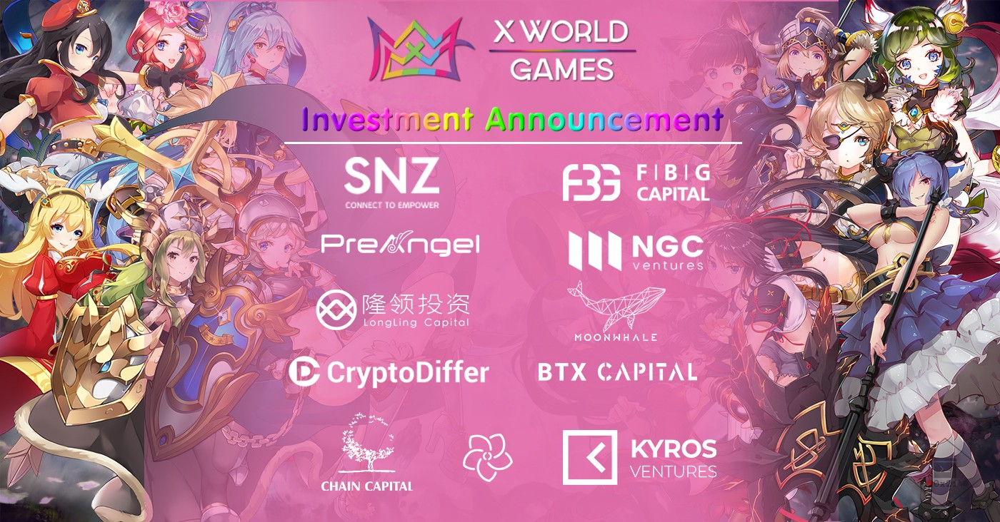

# 💵 Investors

We are very excited to announce a **$2M** strategic funding from institutional investors, including [**NGC Ventures**](https://www.ngc.fund/)**,**[**PreAngel Fund**](http://www.preangelfund.cn/)**,**[**AU21 Capital**](https://au21.capital/) **,** [**FBG Capital**](https://www.fbg.capital/)**,** [**LongLing Capital**](http://www.longling.com/)**,** [**SNZ**](https://snzholding.com/)**,** [**Chain Capital**](http://capital-chain.com/)**,** [**Moonwhale ventures**](https://moonwhale.ventures/)**,** [**CryptoDiffer**](https://cryptodiffer.com/news/)**,**  [**Lanlaxy Group**](http://www.lanlaxy.com/)**,** [**Catcher VC**](https://www.chaincatcher.com/)**,** [**Titans Ventures**](https://titans.ventures/) and etc**.**

We are excited to see so many top crypto institutional investors in the space were interested in supporting blockchain gaming and acknowledging XWG’s open-ecosystem vision and progressive roadmap. We will further extend the depth of our chain-tech involved within the gaming and improve our overall gaming experience. All this is to achieve a simple goal — to provide a simple and fun gaming ecosystem for crypto and non-crypto players.

| Strategic Funding Round                           |
| ------------------------------------------------- |
| [0x21 Labs](https://0x21labs.xyz/)                |
| [Catcher VC](https://www.chaincatcher.com/)       |
| [Chain Capital](http://capital-chain.com/)        |
| [Itsblockchain](https://itsblockchain.com/)       |
| [NGC Ventures](https://www.ngc.fund/)             |
| [PreAngel Fund](http://www.preangelfund.cn/)      |
| [FBG Capital](https://www.fbg.capital/)           |
| [AU21Capital](https://au21.capital/)              |
| [LongLing Capital](http://www.longling.com/)      |
| [SNZ](https://snzholding.com/)                    |
| [Moonwhale Ventures](https://moonwhale.ventures/) |
| [CryptoDiffer](https://cryptodiffer.com/news/)    |
| [Lanlaxy Group](http://www.lanlaxy.com/)          |
| [ChainLink Cap](http://www.chinalinkcap.com/)     |
| [Consensus Lab](http://consensus-lab.com/)        |
| [Crasolum](https://crasolum.com/)                 |
| [LYVC](http://avstarcapital.co/)                  |
| [AVSTAR Capital](http://avstarcapital.co/)        |
| [CoinMix](https://twitter.com/coinmix2019)        |
| [Titans Ventures](https://titans.ventures/)       |

