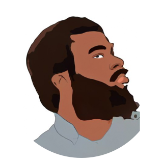

# 👪 Team

### **Fernando Liu**

**Co-Founder, CEO**

* Former Asia Pacific president of Wall Street private equity investment fund Barron Partners
* Experienced in investing and incubating companies listed on the New York Stock Exchange and Nasdaq.&#x20;
* 17+ Years experience in venture capital, private investment, fundraising, and M\&A restructuring experience worldwide.&#x20;
* Served as CFO and other officer roles in various US publicly listed companies.&#x20;
* Investor in crypto-games and blockchain since 2017

**LinkedIn：**[**https://www.linkedin.com/in/fernando-oscar-liu-536a0720a/**](https://www.linkedin.com/in/fernando-oscar-liu-536a0720a/)****

### **Sean Chen**

**Co-Founder, CTO**&#x20;

* 15+ years of experience in the online gaming and software sector.&#x20;
* 5 years experience in the crypto market Founder of BlaCat game platform&#x20;

**LinkedIn：**[**https://www.linkedin.com/in/xcsean**](https://www.linkedin.com/in/xcsean)****

.png>)

### **Ada Yuan**

**Co-Founder, COO**&#x20;

* Crypto investor & community advocate since 2012
* Former product manager at Tencent Singapore
* Veteran in NFT gaming product design, development strategy and WEB 3.0 adoption in gaming.&#x20;

**LinkedIn：**[**https://www.linkedin.com/in/ada-jyun-6286b720b/**](https://www.linkedin.com/in/ada-jyun-6286b720b/)****

### **Edwin Liu**

**Co-Founder, CGO**

* A senior marketing specialist and financial analyst with a decade-long accumulation of experience in various business portfolios and investment, also a crypto investor since 2013.
* Responsible for managing and growing Cardano Foundation's Asian & N. America communities beyond 100k.&#x20;
* Actively contributed and participated in multiple blockchain projects' incubation and development, including ones that were later invested by industry-recognized VC funds.

**LinkedIn:** [ **https://www.linkedin.com/in/edwin-xwg/**](https://www.linkedin.com/in/edwin-xwg/)****

### **Jouinss**

**Head of Community**&#x20;

* 10+ years as Back-end Engineer specializing in encryption, tokenization, and anything PCI-related at Fiserv.&#x20;
* Team member of Apple Pay's back-end processing.&#x20;
* Avid Gamer, left the financial sector to pursue his passion as Game Master at Aeria Games.&#x20;
* Bitcoin veteran since 2016, also experienced in building Smart Contracts on Ethereum.

**LinkedIn:** [**https://www.linkedin.com/in/j0uinss8/**](https://www.linkedin.com/in/j0uinss8/)

### **Kata Botica**

**Head of Global Engagement**&#x20;

* Over 5 years corporate industry experience in the technology, administration, HR, and social media marketing space.
* More than 2 years of experience in the crypto space, with knowledge of industry trends and community engagement.
* Previous experience in Talent Acquisitions for the gaming industry (client Electronic Arts), for the accounting field (Smythe LLP), and in the tech industry (Yardi Systems Inc.).

**Linkedin:** [**https://www.linkedin.com/in/stefaniebotica/**](https://www.linkedin.com/in/stefaniebotica/)****
