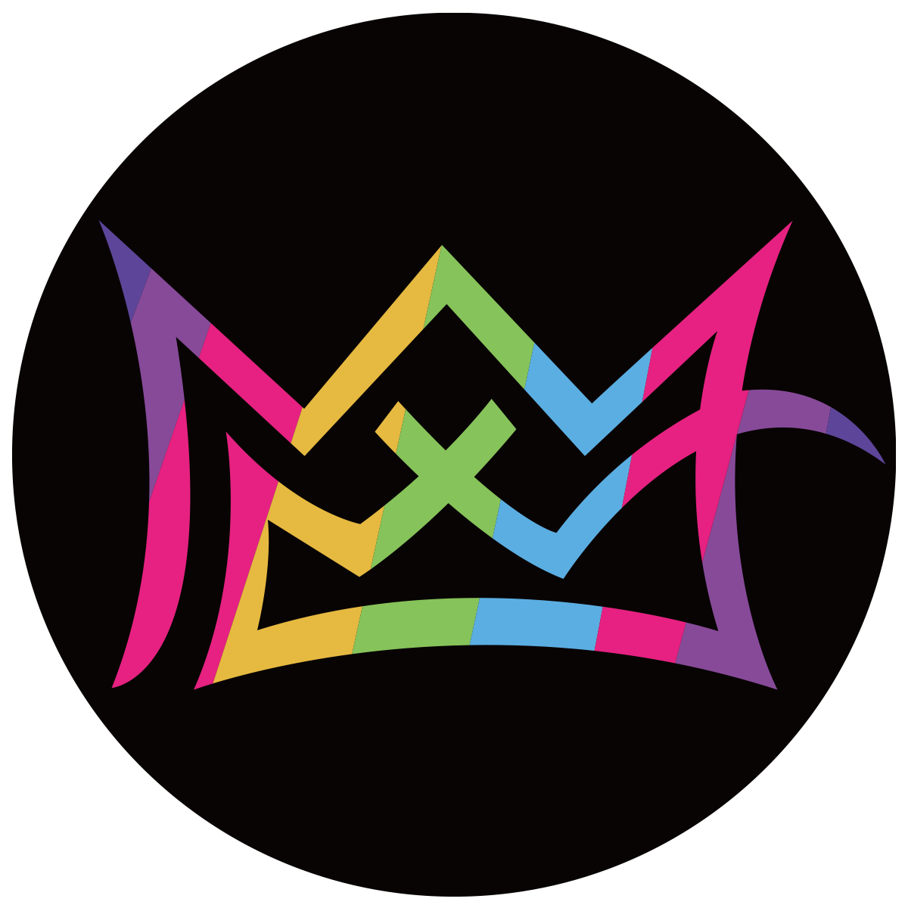

# 介绍

### 什么是X World Games Dao?

通过 DAO 实现真正去中心化的游戏世界所有权。持有 XWG 代币的游戏者可以决定平台治理政策或下一个游戏内部开发，包括奖励机制和通证经济。   
  
X World Games 的最终目标是成为一个真正的用户拥有的游戏平台，拥有自己的去中心化组织，称为社区委员会\(Community Council\)，由社区管理。因此，我们整合了 DAO 的概念，随着时间的推移，它可以接管游戏中大部分新角色的权力。

