# 英雄角色

XWG NFT 夢想卡 (Dream Card) 的本質以 BEP-721 格式發布。每張夢想卡都有品質、元素、技術、HP、ATK、等級等特性，基於XWG團隊開發或第三方合作開發的獨家IP分配，使每張夢想卡都具有獨特性和收藏價值。除了每張夢想卡的收藏價值外，XWG還將允許夢想卡持有者在XWG 遊戲中使用它們進行對戰，以及將它們兌換成XWG BEP-20代幣。 \
‌\
下面就讓我們一起來看看夢想卡中英雄的人物介紹：

#### 1.莉絲

凡人國度的法師，自幼便為了奪得天賜神格而努力，她崇拜巫術魔法，喜歡冒險，雖然魯莽，卻心懷正義，喜歡幫助她人，少時見過艾德琳，明白她一生或許都無法在魔法巫術上超越這樣一個天才，於是她開啟了魔武雙修的道路。在最終神格一戰中，突然棄權，但實際已經被夢魘攝魂。

#### 2. 米迦勒

米迦勒作為神的捍衛者，通過千萬年的廝殺來鞏固了神唯一且至高無上的地位。同時她也在無盡的戰鬥中變得冷血無情，但在與提婭一戰中被其重傷，幸被巫女艾德琳救下。朝夕相處中，米迦勒和艾德琳成為了無話不談的好友，但米迦勒卻從未透露自己神的身份，因為在艾德琳眼中，神是仁慈而偉大的，而她不是。當提婭尋找到米迦勒之後，在又一番鏖戰中，米迦勒燃燒生命使出了米迦勒之舞打敗提婭，而其神格也燃燒殆盡。而成為凡人的米迦勒也開始為重新成為一個仁慈而偉大的神而努力。

#### 3. 蓋亞

世界上第一個放棄神格的神，曾作為大地的守護者，擁有最強壯的血脈。她放棄神格的原因也是因為看到了米迦勒一類人的無情征戰。所以蓋亞拋棄了她的武器赤戮，只留下聖盾和聖劍。

#### 4. 阿蠻

阿蠻作為野流部落的人，從小便勵志不凡，可惜自幼纖細，為了證明自己，她苦練武技，因緣際會得到了代行者的指點而實力大增。後又遇薔薇，在薔薇的幫助下得到了角刃。後滲入野流部落所守護的恐懼山脈深處，斬殺了巨角龍獅，得到了部落的認可。在得知薔薇要幫助自己的好友參加神格爭奪戰時，也自告奮勇，一同前往，是個堅毅直爽的戰士。

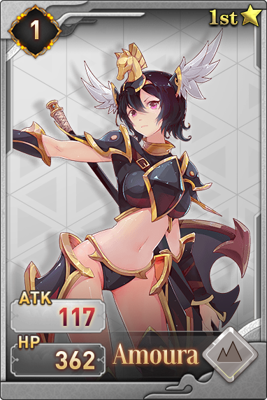

#### 5. 無雙

擁有神奇不老特質的戰士，作為薔薇的師傅，無雙一輩子只想培養一個能完全繼承自己的人，幸運的是她遇到了薔薇。在偶入神格爭奪戰中，意外發現自己與提婭竟然的同一族，與提婭得知真相後的釋懷不同，無雙認為神仍有不可推卸的責任。

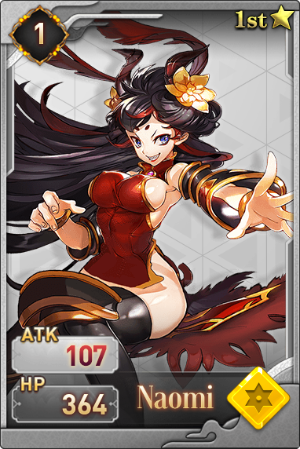

#### 6. 影

作為一直陪伴在塞壬身邊的影，她從未離開過她一步，而這一切僅僅是因為她幼時玩樂時，被塞壬意外所救，儘管後來知道當時塞壬並沒有救她，但是執著已生，再難回頭。

#### 7. 薔薇

與艾德琳同村的薔薇原名塞納麗，在十歲時便隨著師傅四處遊行，在得到師傅所有真傳之後，化名薔薇，開始了漫長的佣兵之旅。她手持閃電之刃行走世界，一心只為錢，她的夢想就是組建一個屬於自己的軍團，但卻被夢魘算計，意外捲入神格之戰中。巧遇艾德琳之後，決定幫助兒時的玩伴完成夢想，但卻從未透露過自己的真實身份，也是她讓神格爭奪戰中的參加者明白了一切都是夢魘的計劃。

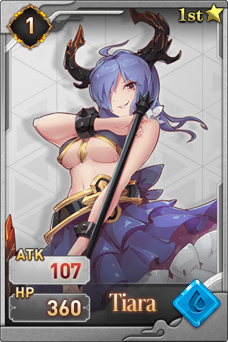

#### 8.提婭

世人皆崇拜神，萬物皆渴望成神。而提婭卻偏偏要弒神。在千年之前，米迦勒在一次征伐中，滅盡提婭一族，倖存下來的提婭苦尋蓋亞傳說，在漫長歲月中不斷修煉自己，用神的方式殺神，這是提婭的目標，她偶得遺失的神器赤戮，自身修為大增，故而開始復仇之旅。目前為止，提婭是唯一曾打敗過米迦勒的凡人。在不斷的複仇中，她才發現，滅族之災遠沒有那麼簡單。

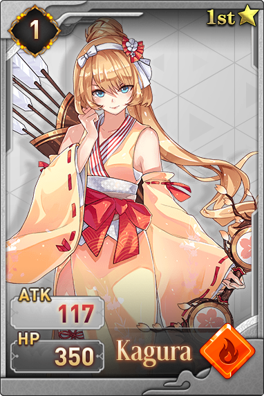

#### 9.神樂

凡人世界的一名巫師，與艾德琳的魔法專修，莉絲魔武雙休不同的是，神樂因為其自幼多病的體質，研發了將法術刻入箭中的方法，所以凡人們常有爭論，到底她和風行者誰才是天下最強的射手，可就算到了最終的神格爭奪戰，她們都未曾正面決鬥過。

#### 10.拉米亞

懷有遠古血脈的拉米亞一直是曙光的崇拜對象，她自幼出眾，眾星捧月。如果不是她宣布自己絕不會參與神格爭奪戰，那麼她將會代替守望者，成為人們口中最有希望成為神的人。她美麗，聰慧，善良而又強大。因為夢魘的蠱惑，而意外參與神格爭奪戰，但也是參戰人中第一個清醒過來的，雖未曾發覺真相，但一直維持本心，好好生活，成為一個開心的人。

#### 11.蘭瑟

凡人國度的公主踏上了冒險之旅，蘭瑟從開始到最後，都未曾將一個國家的壓力放在身上，她四處遊玩，沒有熱河的目標和目的，偶爾路見不平，偶爾捉弄當地的官員。蘭瑟的內心極為純真，就連夢魘都未能蠱惑她，是唯一一個讓夢魘垂頭喪氣的人，誤打誤撞闖入神格爭奪戰，和幾乎所有參加者成為了好朋友。

#### 12.菲爾德

光明與黑暗並非只有對立，使用暗魔法的人，也不一定就是十惡不赦之人，菲爾德就是這樣一個人。 菲爾德僅僅因為喜歡黑色，就從學習光魔法轉而向暗魔法，且掌握速度極其快。 她猶如一個遊俠，四處遊走，與薔薇風行者是無話不談的好友，對掌握强大光魔法的艾德琳也是欽佩有加。 在看到光耀施展的紅魔法之後，堅信混沌魔法不只為紅，决心鑽研藍魔法，並意外獲得了藍燈之熒。

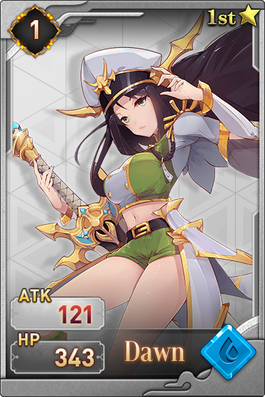

#### 13.曙光

作為懷有遠古血脈的曙光，自幼便是為了成為神而存在，她摒弃周遭一切，苦練12年的武藝，只為弘揚自己遠古一裔，她乃至她的家族，一生都背負著這樣沉重的使命，雖為曙光，卻有12年的時間未曾見過太陽。

#### 14.芙蕾雅

野流部落當下最强之人，也是唯一一個鼓勵阿蠻的人，是阿蠻心中的好姐姐。 她曾斬殺過無數從恐懼山脈中逃竄出來的妖獸，也曾身處滿是蓋亞和眾神神迹的地方，但她堅信，人的進步，不可借助外物，所以她並沒有挪用，也曾斥責過阿蠻不該使用角刃來提升自己的力量，雖然參加了神格爭奪戰，但還是為了保護阿蠻， 因為她認為人有人的價值，不必妄圖成為誰。

#### 15.緋顏

作為凡人世界王國的將軍，她一生戰功無數，一把長刀令人聞風喪膽，也正是她傳奇的經歷，促使了蘭瑟的冒險之旅。 意外聽說神格爭奪戰之後，鐵血性格讓她毫不猶豫地投入了戰鬥之中，被米迦勒評為最像自己的人。

#### 16.伊薇

凡人國度的一名遊俠，也是神格爭奪戰的擁躉者，在遊俠的過程中不斷傳播這有關神格爭奪戰的一切，但是卻錯過了最後的神格爭奪戰，在結束之後才匆忙趕到現場。

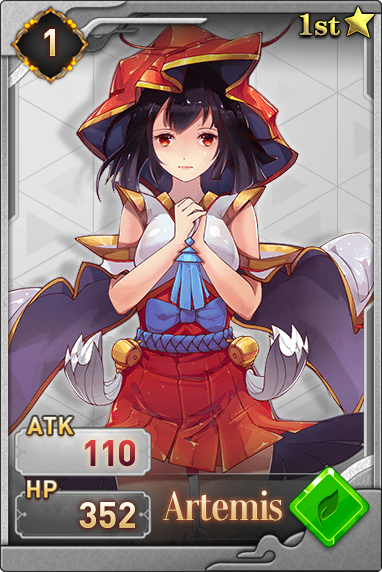

#### 17.御神

每一代神於人間的使者都喚作御神，天下所有信徒的至尊權威。凡神往昔曾過之處，皆有時間留駐的分身，御神便可通過召喚這些過時的分身進行戰鬥，而御神又是絕對禁止參與神格戰鬥的，但在夢魘潛移默化的影響下，這一代的御神明白，神遺於世間的過時分身有限，總有耗盡的一天，不如全部召喚，吸收所有力量，積少成多，即便達不到神的高度，也能是個半神。在神格爭奪戰中，作為夢魘最大的助力不斷壓制多數參賽者，冷漠而又無情，虔誠而又違逆。

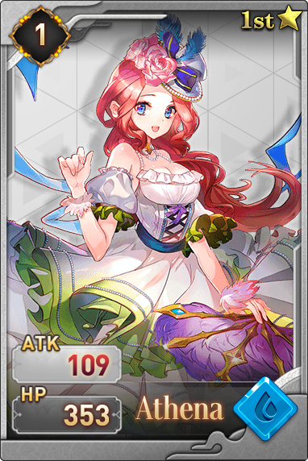

#### 18.西芙

逗留在世間的隱神，與無數放展現過強大的複蘇。雖然戰力並不低，但卻不善於戰鬥，喜歡人世間一切美好，始終無法理解渴望成為神的人們的想法，因為神界是冷清的，白色雲朵上永不凋謝的花朵，在她看來毫無生機，偶遇消散神格的米迦勒時，曾連續捉弄米迦勒多次，見到阿諾之後，看到其神奇，於是前往恐懼山脈。

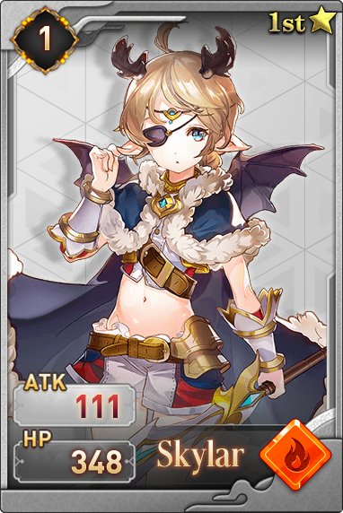

#### 19.夜空

夜空一直都想成為海上的霸主，做九海疆域最強的海盜王。也是第一個占到夢魘便宜的人，夢魘蠱惑夜空時，許諾給她一對自己副翼。夜空作為最出名的海盜之一，反向蠱惑了夢魘。為了不讓夢魘奪回翅膀，夜空與苦海取得夜澪鯨的苦膽，自此一生都不用睡眠，更不會做夢。於是在夢魘攝魂莉莉絲之後獲得實體之後，第一時間就是找夜空復仇。

#### 20.風魔

作為最出名的海盜之一，風魔是夜空成為海盜王的最大的對手，風魔的海盜船在所有海盜中是最快的，所以雖然海盜之間的戰鬥經歷過無數次，但是風魔的損失最小，打不過就跑是她一貫的準則，在見到夜空獲得神秘的翅膀之後，風魔勵志也要尋找這種奇蹟，在聽得神格爭奪戰後，便覺決定參加，夢魘曾蠱惑風魔幫自己奪回翅膀，奈何風魔是個在夢中也極其防備的人，所以夢魘無法趁虛而入。

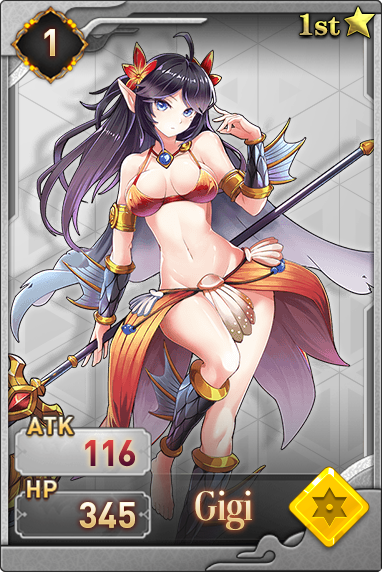

#### 21.磯姬

海中靈物，對於海盜深惡痛覺，與許多海盜進行過戰鬥，最好的朋友被斬殺奪走海膽之後，磯姬暴走，攪得九海天翻地覆，跟踪風魔後參加了神格爭奪戰，於水中從無敵手，只想著成神之後，可以復活自己的夜澪鯨。

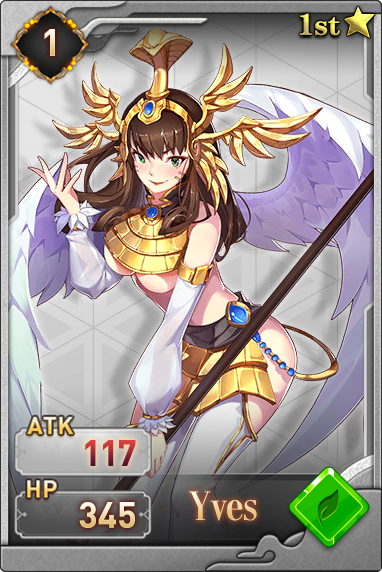

#### 22.伊西斯

神格爭奪戰最後的證關人，雖然作為神，不該參與戰鬥，但是一直給默默失敗的人療傷，這也早場了歷年來的戰鬥從未有人死亡，也造成了沒有人畏懼參加戰鬥，因為不會死，通過米迦勒的口知道了夢魘的計劃，妄圖飛升天空尋找救援，卻被夢魘封鎖，雖然通過強大的氣息逃脫，卻被剪了雙翼。

#### 23.代行者

三位一體，如影形隨！三影中最出名的存在，因為她從不隱匿於人世間，她行走世間，是每個國度都尊重的行走，所過之處，如有不平，必代王權，無情處治。一生致力於尋找神蹟，是從一開始便對神格爭奪戰保持懷疑的人，無數次接近真相。在神格爭奪戰中，她說了夢魘的存在。

#### 24.蘇爾

焚焰山域的土著戰士，於火焰深處獲得龍炎精晶，並將其打造成武器。渴望帶領部落前往富饒之地，於伊薇口中得知神格爭奪戰，於是單槍匹馬前往，後與費蕾雅成為好友。

#### 25.後卿

恐懼山脈被斬殺的妖獸怨靈聚集凝結成的實體，沒有體溫，沒有痛覺，嗜血好戰，在阿蠻芙蕾雅等人離開部落之後，出山大殺野流部落。怒斥幻化人形的狐妖忘本，與其惡戰，根本不關心神格爭奪戰，只想殺死野流部落一脈。

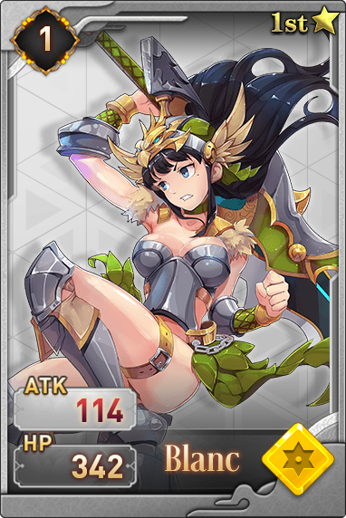

#### 26.白

來自遼闊的草原，彪悍好鬥，不屈不撓，是其部落獲得最多榮譽的展示，獨自一人斬殺過鐵翼獒鷹，馴服過棘甲凶獸，從遊俠口中聽說了外面的世界，於是獨自一人出走，穿越過雪山大海，鏖戰過海盜傭兵，曾被緋顏看中，欲選為副將，被她拒絕，參加神格爭奪戰的原因很簡單，就是會會天下戰士。

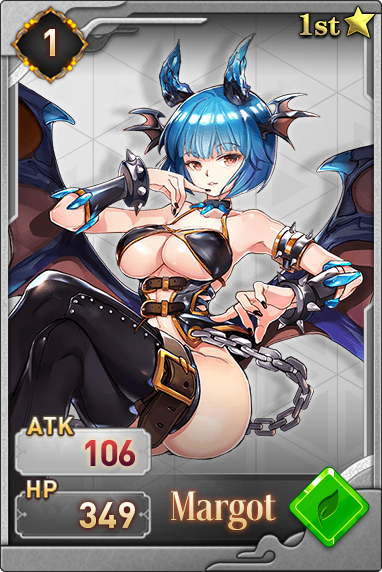

#### 27.夢魘

提婭一族滅族的罪魁禍首，也是她在夢中幫提婭得到了神器。神非唯一，人亦多族，而夢魘確實世界上唯一的存在，她原本親近凡人，常於悲傷之人夢中給其預兆，幫助她們獲得美好生活，但人總是感謝神，於是充滿憎恨的她成了令人恐懼，卻無法知道其踪蹟的夢魘。夢魘蠱惑無數人參加神格爭奪戰，計劃在最後的勝者承神之時攝魂，獲得神魔雙格進化為超越體，她只有一個目標，人神俱滅。原本生有四翼，被夜空騙走副翼，在剪斷伊西斯一對翅膀之後，強加在身上獲得了神魔雙元之力。

#### 28.艾德琳

神的使徒，自修便是村落中天賦極高的巫女，善良勇敢而富有正義，她的虔誠影響了一生好戰的米迦勒，並與米迦勒形成了一生不斷的羈絆。通過米迦勒與提婭一戰，而明白了唯心之外，個人的力量也至關重要，故而攜手米迦勒，開始了成神這一漫長的道路，因為米迦勒得知部分神秘，所以幫她得到了《天國之吟》，法力突飛猛進，被後世譽為凡人法師之巔。

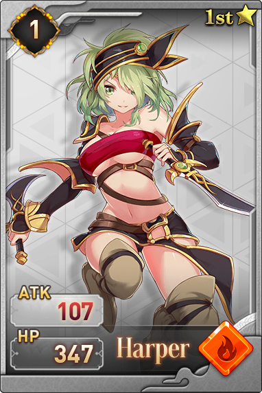

#### 29.湮滅

湮滅，原名芙薇，作為代行者最忠實的粉絲，一直跟隨者代行者，甚至為此也給自己取了一個新名字。雖然好鬥魯莽，但是為人也有點神經大條，代行者曾無數次接近神格爭奪戰的真相，都是因為她的插科打諢而又無數次遠離真相。在神格爭奪戰中看到了風行者的身姿，於是又視風行者為自己的偶像，令人啼笑皆非，雖然實力總是差一點點，但是運氣爆棚，不是她，風行者也發現不了神樂掉落的箭。湮滅

#### 30.芙娜

芙娜和湮滅本是姐妹倆，奈何妹妹神經大條，芙娜也是無計可施。家傳武藝本就卓越的芙娜，參加神格爭奪戰的原因很簡單，就是成神之後，可以徹底改造自己的妹妹。最後也終於明白，每個人的人生軌跡都是不同的。

#### 31.幽磷

原本是四處遊行的馬戲團的一員，受到夢魘的蠱惑而掌握了荒誕怪異的魘術。在神格爭奪戰中，一度成為夢魘的傀儡，再被光耀的紅魔法影響後，回歸了本性，並在阿諾的幫助下將陷入魘中的眾人拉出。

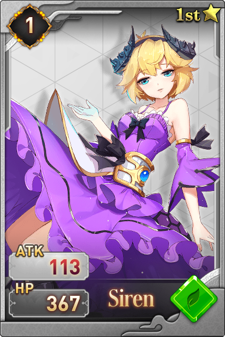

#### 32.塞壬

神之一族的地上後裔，神格爭奪戰的守護者和守關人，本體為蛇，行動速度尤其快，毒武雙修之神，也是米迦勒曾經的追隨者者，對於米迦勒所謂的仁慈之神之說十分唾棄，才明白自己被夢魘蠱惑後妄圖自爆同歸於盡，但遺憾失敗，並因為守關失敗，遭來天譴。

#### 33.守望者

三位一體，如影形隨！三影中最強大的存在，攻守兼備，實力超群，曾與薔薇鏖戰三百回合，雖未分出勝負，但明顯她更佔上風。她是蓋亞最忠實的信徒，也是蓋亞遠古血脈的傳人，被稱為最有希望奪得神格的人，但其一身背負責任太多，始終無法豁達，在神格爭奪戰中固執己見，不顧眾人勸阻，中了夢魘的詭計，流失了遠古血脈，但也由此給了風行者箭射夢魘的機會，是個矛盾的人。

#### 34.赫斯提亞

一直想要成為神的阿雅，乾脆自己取名為赫斯提亞，雖然沒有武藝，沒有魔法，但是一手研發做的令人刮目相看，通過築造武器，一路過關斬將。

#### 35.斯卡蒂

荒蕪之地，黃金峽谷的戰士，也是渴望帶領自己的部落走向富饒之地，是一個堅韌不拔但是高傲的戰士。她掌握了兩個蓋亞的奇蹟，力量，防禦和速度都相當平衡的一人。

#### 36.狐妖

恐懼山脈的靈物，本體是狂獸，曾與芙蕾雅戰鬥過數次，因緣際會在阿諾的修煉人形時沾染了氣息，蛻變成充滿靈智，對世界充滿好奇，得知不但可以成人，還能成神之後，為了福澤更多的靈獸，絕對參加神格爭奪戰。因為自身的氣息，與芙蕾雅極其不對付，在神格爭奪戰中，二人直接對戰起來，看似參加了神格爭奪戰，但自始至終都是她們倆自己在戰鬥。

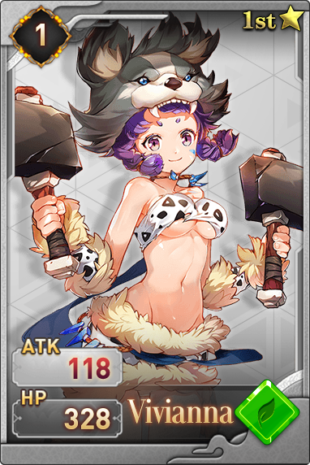

#### 37.芬里爾

極寒之地的芬里爾是一個熱心腸的戰士，無數冒險者在極寒之地都曾受到過她的幫助，雖然自小生活在苦寒之處，但是並沒有遷移的打算，參加神格爭奪戰的原因也是很簡單，就是想證明，在絕對的力量面前，魔法招式都不管用，是一個直心腸而又天神巨力的人。

#### 38.風行者

三位一體，如影形隨！風行者作為三影之一，擁有幾乎冠絕天下的箭術，她身手敏捷，神出鬼沒。與提婭乃是好友，幫助提婭對付米迦勒，在知曉滅族之因後第一時間穿越千山萬里告訴心如死灰的提婭，將其從頹廢邊緣拉出，是一位值得信任和託付的好友。在神格爭奪戰中，撿到一把刻有符咒的箭，一箭命中夢魘，使其幻影具象。

#### 39.光耀

凡人國度的法師，莉絲的親姐姐，對于莉絲魔武雙休非常厭惡，發誓成神之路無人可當，自己領悟了介於光魔法和暗魔法之間的紅魔法，自認為一切混沌。為人高傲，雖然看不上妹妹，但內心深處對妹妹比誰都憐愛，只允許自己欺負妹妹。這樣一個渴望成神的人，因為聽米迦勒講述了自己的故事，但是自己成神之後會忘記對妹妹的感情，最後還是放棄了，一心決定將紅魔法發揚光大。

#### 40.阿諾

恐懼山脈的靈物化形，擁有強悍的生命氣息復原之術，也是在她的幫助下阿蠻才找到了戰勝巨角龍獅的秘訣。很喜歡阿蠻給她取的名字，勵志要修得一個完整獨立的人形，這樣就可以陪阿蠻冒險。因為曾見過芙蕾雅斬殺過無數狂獸，所以天然對她畏懼，但她不知道的是，阿諾是芙蕾雅的乳名。
