# 英雄角色

XWG NFT 梦想卡 \(Dream Card\) 的本质以 BEP-721 格式发布。 每张梦想卡都有品质、元素、技术、HP、ATK、等级等特性，基于XWG团队开发或第三方合作开发的独家IP分配，使每张梦想卡都具有独特性和收藏价值。 除了每张梦想卡的收藏价值外，XWG还将允许梦想卡持有者在XWG 游戏中使用它们进行对战，以及将它们兑换成XWG BEP-20代币。   
‌  
下面就让我们一起来看看梦想卡中英雄的人物介绍：

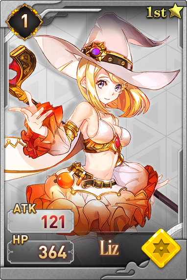

#### 1.莉丝

凡人国度的法师，自幼便为了夺得天赐神格而努力，她崇拜巫术魔法，喜欢冒险，虽然鲁莽，却心怀正义，喜欢帮助她人，少时见过艾德琳，明白她一生或许都无法在魔法巫术上超越这样一个天才，于是她开启了魔武双修的道路。在最终神格一战中，突然弃权，但实际已经被梦魇摄魂。

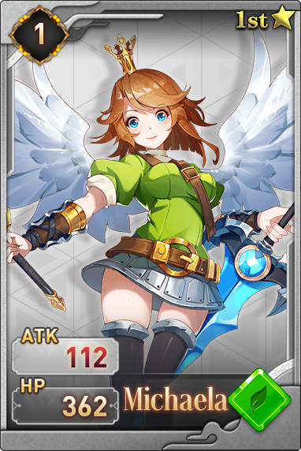

#### 2. 米迦勒

米迦勒作为神的捍卫者，通过千万年的厮杀来巩固了神唯一且至高无上的地位。同时她也在无尽的战斗中变得冷血无情，但在与提娅一战中被其重伤，幸被巫女艾德琳救下。朝夕相处中，米迦勒和艾德琳成为了无话不谈的好友，但米迦勒却从未透露自己神的身份，因为在艾德琳眼中，神是仁慈而伟大的，而她不是。当提娅寻找到米迦勒之后，在又一番鏖战中，米迦勒燃烧生命使出了米迦勒之舞打败提娅，而其神格也燃烧殆尽。而成为凡人的米迦勒也开始为重新成为一个仁慈而伟大的神而努力。

#### 3. 盖亚

世界上第一个放弃神格的神，曾作为大地的守护者，拥有最强壮的血脉。她放弃神格的原因也是因为看到了米迦勒一类人的无情征战。所以盖亚抛弃了她的武器赤戮，只留下圣盾和圣剑。

#### 4. 阿蛮

阿蛮作为野流部落的人，从小便励志不凡，可惜自幼纤细，为了证明自己，她苦练武技，因缘际会得到了代行者的指点而实力大增。后又遇蔷薇，在蔷薇的帮助下得到了角刃。后渗入野流部落所守护的恐惧山脉深处，斩杀了巨角龙狮，得到了部落的认可。在得知蔷薇要帮助自己的好友参加神格争夺战时，也自告奋勇，一同前往，是个坚毅直爽的战士。

#### 5. 无双

拥有神奇不老特质的战士，作为蔷薇的师傅，无双一辈子只想培养一个能完全继承自己的人，幸运的是她遇到了蔷薇。在偶入神格争夺战中，意外发现自己与提娅竟然的同一族，与提娅得知真相后的释怀不同，无双认为神仍有不可推卸的责任。

#### 6. 影

作为一直陪伴在塞壬身边的影，她从未离开过她一步，而这一切仅仅是因为她幼时玩乐时，被塞壬意外所救，尽管后来知道当时塞壬并没有救她，但是执着已生，再难回头。

#### 7. 蔷薇

与艾德琳同村的蔷薇原名塞纳丽，在十岁时便随着师傅四处游行，在得到师傅所有真传之后，化名蔷薇，开始了漫长的佣兵之旅。她手持闪电之刃行走世界，一心只为钱，她的梦想就是组建一个属于自己的军团，但却被梦魇算计，意外卷入神格之战中。巧遇艾德琳之后，决定帮助儿时的玩伴完成梦想，但却从未透露过自己的真实身份，也是她让神格争夺战中的参加者明白了一切都是梦魇的计划。

#### 8.提娅

世人皆崇拜神，万物皆渴望成神。而提娅却偏偏要弑神。在千年之前，米迦勒在一次征伐中，灭尽提娅一族，幸存下来的提娅苦寻盖亚传说，在漫长岁月中不断修炼自己，用神的方式杀神，这是提娅的目标，她偶得遗失的神器赤戮，自身修为大增，故而开始复仇之旅。目前为止，提娅是唯一曾打败过米迦勒的凡人。在不断的复仇中，她才发现，灭族之灾远没有那么简单。

#### 9.神乐

凡人世界的一名巫师，与艾德琳的魔法专修，莉丝魔武双休不同的是，神乐因为其自幼多病的体质，研发了将法术刻入箭中的方法，所以凡人们常有争论，到底她和风行者谁才是天下最强的射手，可就算到了最终的神格争夺战，她们都未曾正面决斗过。

#### 10.拉米亚

怀有远古血脉的拉米亚一直是曙光的崇拜对象，她自幼出众，众星捧月。如果不是她宣布自己绝不会参与神格争夺战，那么她将会代替守望者，成为人们口中最有希望成为神的人。她美丽，聪慧，善良而又强大。因为梦魇的蛊惑，而意外参与神格争夺战，但也是参战人中第一个清醒过来的，虽未曾发觉真相，但一直维持本心，好好生活，成为一个开心的人。

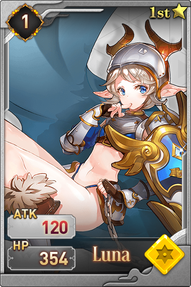

#### 11.兰瑟

凡人国度的公主踏上了冒险之旅，兰瑟从开始到最后，都未曾将一个国家的压力放在身上，她四处游玩，没有热河的目标和目的，偶尔路见不平，偶尔捉弄当地的官员。兰瑟的内心极为纯真，就连梦魇都未能蛊惑她，是唯一一个让梦魇垂头丧气的人，误打误撞闯入神格争夺战，和几乎所有参加者成为了好朋友。

#### 12.菲尔德

光明与黑暗并非只有对立，使用暗魔法的人，也不一定就是十恶不赦之人，菲尔德就是这样一个人。菲尔德仅仅因为喜欢黑色，就从学习光魔法转而向暗魔法，且掌握速度极其快。她犹如一个游侠，四处游走，与蔷薇风行者是无话不谈的好友，对掌握强大光魔法的艾德琳也是钦佩有加。在看到光耀施展的红魔法之后 ，坚信混沌魔法不只为红，决心钻研蓝魔法，并意外获得了蓝灯之荧。

#### 13.曙光

作为怀有远古血脉的曙光，自幼便是为了成为神而存在，她摒弃周遭一切，苦练12年的武艺，只为弘扬自己远古一裔，她乃至她的家族，一生都背负着这样沉重的使命，虽为曙光，却有12年的时间未曾见过太阳。

#### 14.芙蕾雅

野流部落当下最强之人，也是唯一一个鼓励阿蛮的人，是阿蛮心中的好姐姐。她曾斩杀过无数从恐惧山脉中逃窜出来的妖兽，也曾身处满是盖亚和众神神迹的地方，但她坚信，人的进步，不可借助外物，所以她并没有挪用，也曾斥责过阿蛮不该使用角刃来提升自己的力量，虽然参加了神格争夺战，但还是为了保护阿蛮，因为她认为人有人的价值，不必妄图成为谁。

#### 15.绯颜

作为凡人世界王国的将军，她一生战功无数，一把长刀令人闻风丧胆，也正是她传奇的经历，促使了兰瑟的冒险之旅。意外听说神格争夺战之后，铁血性格让她毫不犹豫地投入了战斗之中，被米迦勒评为最像自己的人。

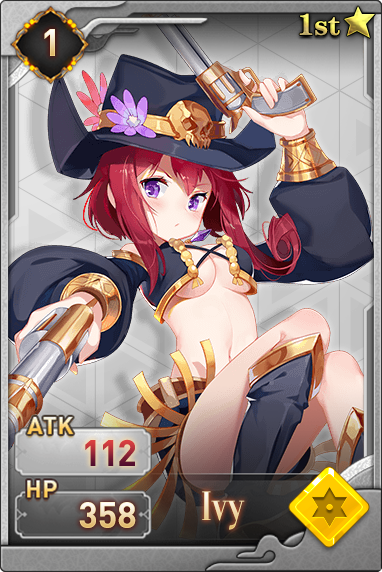

#### 16.伊薇

凡人国度的一名游侠，也是神格争夺战的拥趸者，在游侠的过程中不断传播这有关神格争夺战的一切，但是却错过了最后的神格争夺战，在结束之后才匆忙赶到现场。

#### 17.御神

每一代神于人间的使者都唤作御神，天下所有信徒的至尊权威。凡神往昔曾过之处，皆有时间留驻的分身，御神便可通过召唤这些过时的分身进行战斗，而御神又是绝对禁止参与神格战斗的，但在梦魇潜移默化的影响下，这一代的御神明白，神遗于世间的过时分身有限，总有耗尽的一天，不如全部召唤，吸收所有力量，积少成多，即便达不到神的高度，也能是个半神。在神格争夺战中，作为梦魇最大的助力不断压制多数参赛者，冷漠而又无情，虔诚而又违逆。

#### 18.西芙

逗留在世间的隐神，与无数放展现过强大的复苏。虽然战力并不低，但却不善于战斗，喜欢人世间一切美好，始终无法理解渴望成为神的人们的想法，因为神界是冷清的，白色云朵上永不凋谢的花朵，在她看来毫无生机，偶遇消散神格的米迦勒时，曾连续捉弄米迦勒多次，见到阿诺之后，看到其神奇，于是前往恐惧山脉。

#### 19.夜空

夜空一直都想成为海上的霸主，做九海疆域最强的海盗王。也是第一个占到梦魇便宜的人，梦魇蛊惑夜空时，许诺给她一对自己副翼。夜空作为最出名的海盗之一，反向蛊惑了梦魇。为了不让梦魇夺回翅膀，夜空与苦海取得夜澪鲸的苦胆，自此一生都不用睡眠，更不会做梦。于是在梦魇摄魂莉莉丝之后获得实体之后，第一时间就是找夜空复仇。

#### 20.风魔

作为最出名的海盗之一，风魔是夜空成为海盗王的最大的对手，风魔的海盗船在所有海盗中是最快的，所以虽然海盗之间的战斗经历过无数次，但是风魔的损失最小，打不过就跑是她一贯的准则，在见到夜空获得神秘的翅膀之后，风魔励志也要寻找这种奇迹，在听得神格争夺战后，便觉决定参加，梦魇曾蛊惑风魔帮自己夺回翅膀，奈何风魔是个在梦中也极其防备的人，所以梦魇无法趁虚而入。

#### 21.矶姬

海中灵物，对于海盗深恶痛觉，与许多海盗进行过战斗，最好的朋友被斩杀夺走海胆之后，矶姬暴走，搅得九海天翻地覆，跟踪风魔后参加了神格争夺战，于水中从无敌手，只想着成神之后，可以复活自己的夜澪鲸。

#### 22.伊西斯

神格争夺战最后的证关人，虽然作为神，不该参与战斗，但是一直给默默失败的人疗伤，这也早场了历年来的战斗从未有人死亡，也造成了没有人畏惧参加战斗，因为不会死，通过米迦勒的口知道了梦魇的计划，妄图飞升天空寻找救援，却被梦魇封锁，虽然通过强大的气息逃脱，却被剪了双翼。

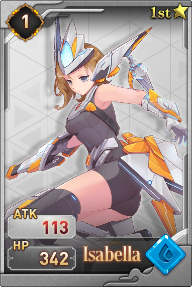

#### 23.代行者

三位一体，如影形随！三影中最出名的存在，因为她从不隐匿于人世间，她行走世间，是每个国度都尊重的行走，所过之处，如有不平，必代王权，无情处治。一生致力于寻找神迹，是从一开始便对神格争夺战保持怀疑的人，无数次接近真相。在神格争夺战中，她说了梦魇的存在。

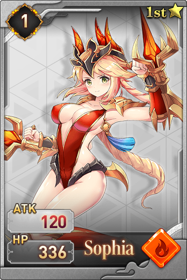

#### 24.苏尔

焚焰山域的土著战士，于火焰深处获得龙炎精晶，并将其打造成武器。渴望带领部落前往富饶之地，于伊薇口中得知神格争夺战，于是单枪匹马前往，后与费蕾雅成为好友。

#### 25.后卿

恐惧山脉被斩杀的妖兽怨灵聚集凝结成的实体，没有体温，没有痛觉，嗜血好战，在阿蛮芙蕾雅等人离开部落之后，出山大杀野流部落。怒斥幻化人形的狐妖忘本，与其恶战，根本不关心神格争夺战，只想杀死野流部落一脉。

#### 26.白

来自辽阔的草原，彪悍好斗，不屈不挠，是其部落获得最多荣誉的展示，独自一人斩杀过铁翼獒鹰，驯服过棘甲凶兽，从游侠口中听说了外面的世界，于是独自一人出走，穿越过雪山大海，鏖战过海盗佣兵，曾被绯颜看中，欲选为副将，被她拒绝，参加神格争夺战的原因很简单，就是会会天下战士。

#### 27.梦魇

提娅一族灭族的罪魁祸首，也是她在梦中帮提娅得到了神器。神非唯一，人亦多族，而梦魇确实世界上唯一的存在，她原本亲近凡人，常于悲伤之人梦中给其预兆，帮助她们获得美好生活，但人总是感谢神，于是充满憎恨的她成了令人恐惧，却无法知道其踪迹的梦魇。梦魇蛊惑无数人参加神格争夺战，计划在最后的胜者承神之时摄魂，获得神魔双格进化为超越体，她只有一个目标，人神俱灭。原本生有四翼，被夜空骗走副翼，在剪断伊西斯一对翅膀之后，强加在身上获得了神魔双元之力。

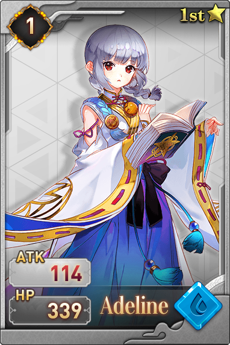

#### 28.艾德琳

神的使徒，自修便是村落中天赋极高的巫女，善良勇敢而富有正义，她的虔诚影响了一生好战的米迦勒，并与米迦勒形成了一生不断的羁绊。通过米迦勒与提娅一战，而明白了唯心之外，个人的力量也至关重要，故而携手米迦勒，开始了成神这一漫长的道路，因为米迦勒得知部分神秘，所以帮她得到了《天国之吟》，法力突飞猛进，被后世誉为凡人法师之巅。

#### 29.湮灭

湮灭，原名芙薇，作为代行者最忠实的粉丝，一直跟随者代行者，甚至为此也给自己取了一个新名字。虽然好斗鲁莽，但是为人也有点神经大条，代行者曾无数次接近神格争夺战的真相，都是因为她的插科打诨而又无数次远离真相。在神格争夺战中看到了风行者的身姿，于是又视风行者为自己的偶像，令人啼笑皆非，虽然实力总是差一点点，但是运气爆棚，不是她，风行者也发现不了神乐掉落的箭。

#### 30.芙娜

芙娜和湮灭本是姐妹俩，奈何妹妹神经大条，芙娜也是无计可施。家传武艺本就卓越的芙娜，参加神格争夺战的原因很简单，就是成神之后，可以彻底改造自己的妹妹。最后也终于明白，每个人的人生轨迹都是不同的。

#### 31.幽磷

原本是四处游行的马戏团的一员，受到梦魇的蛊惑而掌握了荒诞怪异的魇术。在神格争夺战中，一度成为梦魇的傀儡，再被光耀的红魔法影响后，回归了本性，并在阿诺的帮助下将陷入魇中的众人拉出。

#### 32.塞壬

神之一族的地上后裔，神格争夺战的守护者和守关人，本体为蛇，行动速度尤其快，毒武双修之神，也是米迦勒曾经的追随者者，对于米迦勒所谓的仁慈之神之说十分唾弃，才明白自己被梦魇蛊惑后妄图自爆同归于尽，但遗憾失败，并因为守关失败，遭来天谴。

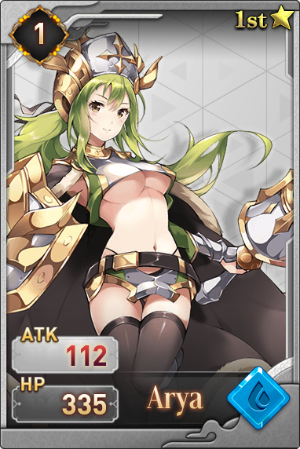

#### 33.守望者

三位一体，如影形随！三影中最强大的存在，攻守兼备，实力超群，曾与蔷薇鏖战三百回合，虽未分出胜负，但明显她更占上风。她是盖亚最忠实的信徒，也是盖亚远古血脉的传人，被称为最有希望夺得神格的人，但其一身背负责任太多，始终无法豁达，在神格争夺战中固执己见，不顾众人劝阻，中了梦魇的诡计，流失了远古血脉，但也由此给了风行者箭射梦魇的机会，是个矛盾的人。

#### 34.赫斯提亚

一直想要成为神的阿雅，干脆自己取名为赫斯提亚，虽然没有武艺，没有魔法，但是一手研发做的令人刮目相看，通过筑造武器，一路过关斩将。

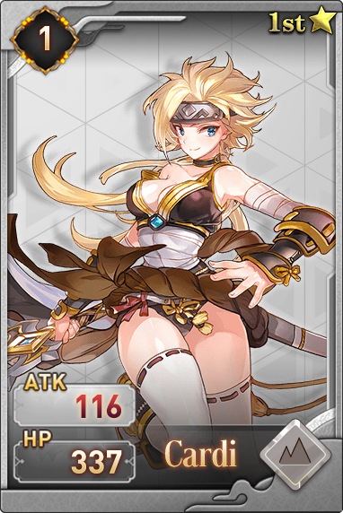

#### 35.斯卡蒂

荒芜之地，黄金峡谷的战士，也是渴望带领自己的部落走向富饶之地，是一个坚韧不拔但是高傲的战士。她掌握了两个盖亚的奇迹，力量，防御和速度都相当平衡的一人。

#### 36.狐妖

恐惧山脉的灵物，本体是狂兽，曾与芙蕾雅战斗过数次，因缘际会在阿诺的修炼人形时沾染了气息，蜕变成充满灵智，对世界充满好奇，得知不但可以成人，还能成神之后，为了福泽更多的灵兽，绝对参加神格争夺战。因为自身的气息，与芙蕾雅极其不对付，在神格争夺战中，二人直接对战起来，看似参加了神格争夺战，但自始至终都是她们俩自己在战斗。

#### 37.芬里尔

极寒之地的芬里尔是一个热心肠的战士，无数冒险者在极寒之地都曾受到过她的帮助，虽然自小生活在苦寒之处，但是并没有迁移的打算，参加神格争夺战的原因也是很简单，就是想证明，在绝对的力量面前，魔法招式都不管用，是一个直心肠而又天神巨力的人。

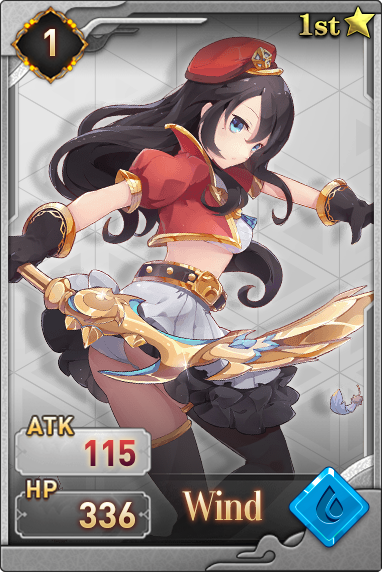

#### 38.风行者

三位一体，如影形随！风行者作为三影之一，拥有几乎冠绝天下的箭术，她身手敏捷，神出鬼没。与提娅乃是好友，帮助提娅对付米迦勒，在知晓灭族之因后第一时间穿越千山万里告诉心如死灰的提娅，将其从颓废边缘拉出，是一位值得信任和托付的好友。在神格争夺战中，捡到一把刻有符咒的箭，一箭命中梦魇，使其幻影具象。

#### 39.光耀

凡人国度的法师，莉丝的亲姐姐，对于莉丝魔武双休非常厌恶，发誓成神之路无人可当，自己领悟了介于光魔法和暗魔法之间的红魔法，自认为一切混沌。为人高傲，虽然看不上妹妹，但内心深处对妹妹比谁都怜爱，只允许自己欺负妹妹。这样一个渴望成神的人，因为听米迦勒讲述了自己的故事，但是自己成神之后会忘记对妹妹的感情，最后还是放弃了，一心决定将红魔法发扬光大。

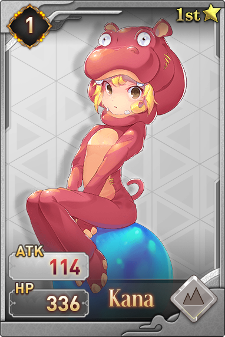

#### 40.阿诺

恐惧山脉的灵物化形，拥有强悍的生命气息复原之术，也是在她的帮助下阿蛮才找到了战胜巨角龙狮的秘诀。很喜欢阿蛮给她取的名字，励志要修得一个完整独立的人形，这样就可以陪阿蛮冒险。因为曾见过芙蕾雅斩杀过无数狂兽，所以天然对她畏惧，但她不知道的是，阿诺是芙蕾雅的乳名。

