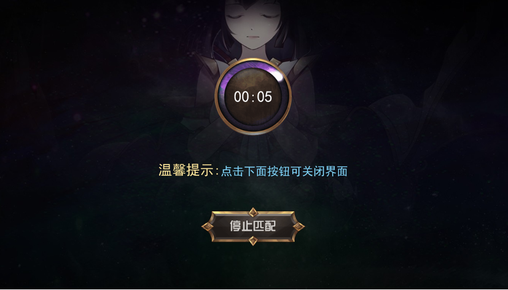

# 新手教学

## 什么是Dream Card？

Dream Card 是X-World-Games游戏生态发布的第一款NFT对战卡牌游戏，游戏卡牌是建立在币安智能链上的数字化，可收藏NFT卡牌。您至少需要获取一张卡牌，即可在网络上与全世界玩家进行匹配对战。

该项目托管在[GitHub](https://github.com/X-World-Games)上. 此处记录了对本页所做的所有更新以及所有过去版本的规则。此外，此页面上的更改日志描述了版本之间的所有规则更改。

您可以在GitHub 页面上或者X-World-Games官网的DAO中报告问题并讨论更改。

DAO是去中心化治理社区，您可以在社区对与游戏相关的各项规则进行讨论并提出修改意见，游戏社区的所有玩家都可以对修改意见进行投票。

## 新手教学

### **1. 介绍**

#### **1.1** 什么是Dream Card？

Dream Card 是X-World-Games游戏生态发布的第一款NFT对战卡牌游戏，游戏卡牌是建立在币安智能链上的数字化，可收藏NFT卡牌。可以在NFT交易市场自由交易，并培育出具有令人振奋的特征和不同程度的可爱形象，强大的战斗属性和交易价值的新角色。

使用卡牌进行策略对战，规则类似于传统的卡牌桌游或网络TCG卡牌游戏，把对方的卡牌消耗完或对方角色生命值为0即可获得胜利。

该文档可作为新手玩家入门标准规则的参考。首次开始前，请仔细阅读该网站内容并准备所需要的工具。

#### **1.2** 入门

Dream Card在PC端浏览器（例如：Chrome或Firefox）和移动端H5页面都可以玩。但是，如果您想充分体验去中心化游戏的乐趣，建议具有：

数字钱包 -像[MetaMask\(小狐狸\)](https://metamask.io/)，[币安钱包](https://www.binance.com/en/wallet-direct) 。数字钱包用作您的个人帐户，可确保您所有的数字资产（例如XWG代币，NFT卡牌，虚拟道具）和虚拟世界中的进展安全。

#### **1.3** 手机号码或邮箱

如果您没有数字钱包，可以使用您的手机号码或邮箱注册登录游戏，您的游戏内数据信息将会被保存在本地。当您需要把游戏内资产进行链上操作时，需要先绑定您的数字钱包地址。

如果这是您第一次听说数字钱包，我们建议您阅读[获取电子钱包–入门指南](https://docs.binance.org/smart-chain/wallet/metamask.html)。

**如果您没有足够的卡牌，则有很多选择：**

#### 新手空投

游戏上线初期将会开启初始卡牌空投活动，活动期间第一次进入游戏的玩家可以免费获得一张普通品质卡牌。活动详情敬请留意官方平台公告。

#### **神秘十连抽**

登陆游戏后，只需要钱包里拥有足够的XWG代币即可参与神秘十连抽，每次可以获得十张卡牌，并且有机会获得高品质卡牌。

#### **神秘盲盒**

在[X World Games](https://xwg.games/)官网[Marketplace](https://nft.xwg.games/)页面可以使用XWG代币购买神秘盲盒，每次开启神秘盒子可获得一张卡牌，并且有机会获得高品质卡牌。

#### 交易市场

拥有很多卡牌的玩家会把他们不需要的卡牌放到交易市场进行售卖，如果你想获得卡牌可以去[交易市场](https://xwg.games/)使用XWG购买。

### **2.** 游戏属性介绍

在进入游戏前，您还需要了解一下内容：

#### **2.1** 指挥官角色

**指挥官角色**：角色就是您的账号，会指挥战斗，角色有等级、生命和总费用3个属性。 

**角色等级**：角色等级通过战斗或商城购买材料来提升。等级越高，生命和总费用越高。此外角色等级还能解锁卡组里的卡槽，增加卡组配置中卡牌的数量。

**角色生命**：战斗时，指挥官角色会被卡牌攻击，生命被消耗到零时，判定战斗失败。

**角色总费用**：决定卡组中卡牌的数量。  

#### **2.2** 卡牌属性

#### 品质

游戏共有五种不同品质的卡牌，分别为普通（Common）、稀有（Rare）、史诗（Epic）、传奇（Legend）、神话（Myth），不同品质卡牌的颜色不同，卡牌品质越高战斗属性越高、拥有的技能数量越多。  

| 品质 | 颜色 | 技能槽上限 | 出战等待回合 |
| :--- | :--- | :--- | :--- |
| 普通 | 白色 | 0 | 1 |
| 稀有 | 绿色 | 1 | 2 |
| 史诗 | 蓝色 | 2 | 4 |
| 传奇 | 紫色 | 3 | 6 |
| 神话 | 橙色 | 4 | 8 |

#### 五行

每张卡牌在生成时都会赋予一个固定五行属性，五行分别：金, 木, 水, 火, 土. 五行相生相克，玩家在组建卡组时可根据不同五行卡牌进行卡牌组合搭配，特定的五行卡牌组合出战时可以触发羁绊效果。

#### 星级

初始生成的所有卡牌的星级为1代1星，使用经验书可以提升卡牌的星级，到达5星后需使用进阶石对卡牌进行进阶升代，卡牌星级最高可升级至3代5星。

#### 技能

稀有及以上品质的卡牌拥有技能槽，卡牌升级到对应星级可解锁技能，卡牌的技能及技能等级随机分配，更多技能详情介绍请查阅[技能配置表](https://drive.google.com/file/d/16_5uAJ6WgTdQRtC-yILUOQs4qembYLzF/view)。

#### 羁绊

游戏特色玩法，适合高端玩家进行策略配置。五行组合、英雄组合等特定的卡组可以触发羁绊效果，战斗时生效，目前五行组合羁绊已经上线。羁绊组合及效果介绍请查阅[羁绊设定表](https://drive.google.com/file/d/1SOHJj_I1xfk_BqbPgSULBAYb3Kvwf7yE/view)。

#### **2.3** 战斗属性

**战力**：可通过卡牌培养提升，战力越高对战获胜的几率越大； 

**生命**：可通过卡牌培养提升，当卡牌生命值为0时会被移出对战牌堆； 

**攻击**：可通过卡牌培养提升，攻击力越高造成对方的伤害值越高；

**回复**：卡牌加入战斗前会进行一次生命值回复，值越高回复的生命越高；

**命中率**：命中率越高攻击时对手卡牌的躲避概率越低； 

躲避率：躲避率越高对手卡牌攻击时躲避概率越高； 

**暴击率**：暴击率越高攻击时出现暴击效果的概率越高； 

**暴击倍数**：暴击倍数越高出现暴击效果时产生的伤害越高； 

**等待回合**：卡牌在加入战斗前需要在牌堆进行等待，等待回合为0时方可加入战斗，卡牌品质越高，等待回合数值越大。

#### **2.4** 升级道具

**经验书**：初级经验道具，可用于提升角色或卡牌经验值； 

**经验石**：中级经验道具，可用于提升角色或卡牌经验值； 

**经验药水**：高级经验道具，可用于提升角色或卡牌经验值； 

**经验宝珠**：特殊经验道具，使用经验宝箱开出来的经验会存储在经验宝珠里，可用于提升角色或卡牌经验值； 

**进阶石**：卡牌升代道具；  

### 3. 新手游戏教程

如果您是第一次进入游戏，建议您先阅读以下新手教程：

游戏中设置了新手引导，只需要按照引导步骤操作完成就可以对游戏有一个基本的了解，引导共4个步骤包括：领取奖励、升级卡牌、配置卡组和匹配战斗。下面，我们一起来体验一下：

#### **3.1** 领取奖励

用户首次进入游戏可以获得一张普通品质卡牌和一本经验书，点击领取按钮奖励就会发放到账户中；

#### **3.2** 升级卡牌

进入卡牌页面可以看到刚才领取的一张普通品质卡牌，我们按步骤对卡牌进行升级操作；

Experience props are materials for upgrading cards, which can be purchased in the in-game mall with XWG tokens;

卡牌升级之后当前经验值为100，此时卡牌已经可以加入卡组进行战斗了。

#### **3.3** 配置卡组

配置卡组是开始战斗前最重要的一环，拥有的卡牌越多可配置卡组的类型越多。初始卡组只有一个卡槽，升级角色等级可以解锁卡槽。

#### **3.4** 匹配战斗

点击首页的“战斗”按钮就可以开始匹配对手，即使只有一张卡牌也没关系，游戏会匹配玩家战力值相近的两个对手进行对战；

进入战斗界面后，可以将牌堆中等待回合为0的卡牌加入战场进行对战，双方回合制攻击，一方卡牌数量为0或角色生命值为0时战斗结束。

战斗胜利的一方将会获得经验值（角色经验值）及战利品宝箱奖励，失败方会扣除一定数量的经验值（卡牌经验值），获得（角色经验值）及战斗宝箱（经验宝箱）奖励。

