# 游戏功能

## 游戏功能

### **转账**

转账分为**充值、提现和记录**3个板块。

**充值**：把钱包内的XWG充值到游戏平台。

**提现**：把游戏平台的XWG提现到钱包。（暂时未开放）

**记录**：记录充值和提现的操作，方便查询。

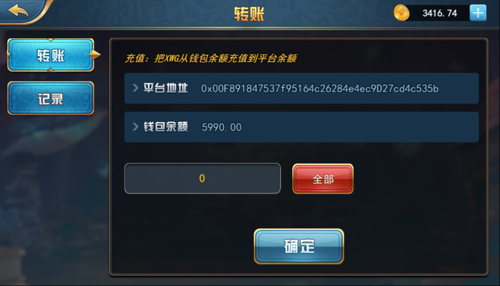

### **转卡**

转卡分为**转入、转出和记录**3个板块。

**转入**：把钱包内的卡牌转入到游戏。

**转出**：把游戏内的卡牌转出到钱包。

**记录**：记录转入和转出的操作，方便查询。

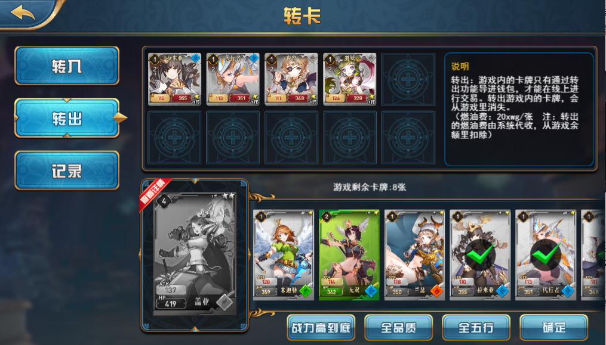

### **商城**

游戏内所有的道具都在商城里面购买。

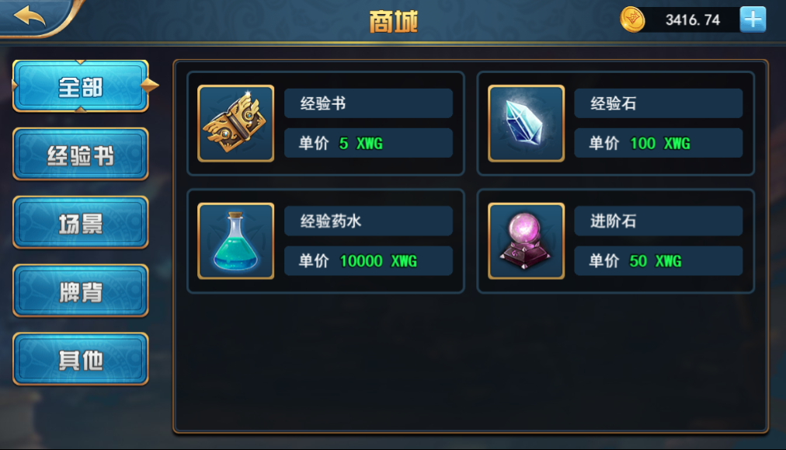

### **任务**

任务分为**每日签到、每日任务、等级奖励、领取奖励**4个板块。玩家通过完成每日签到、每日任务、等级奖励板块里面的任务，获得任务积分；任务积分会在每天特定的时间按照玩家任务积分的贡献比转换成XWG，在领取奖励页面领取。

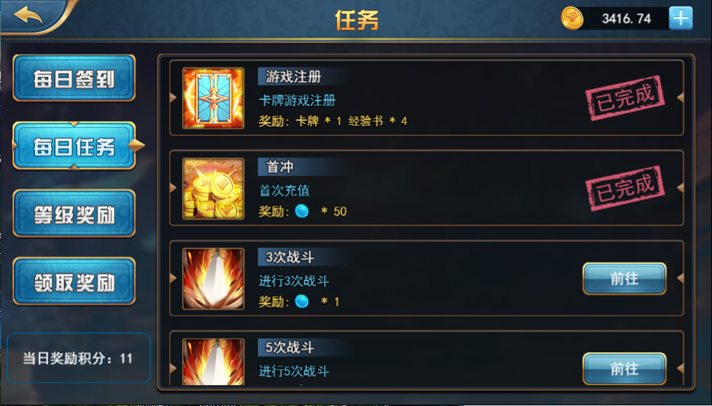

### **背包**

背包显示玩家所有拥有的道具，并且可以对道具进行操作。

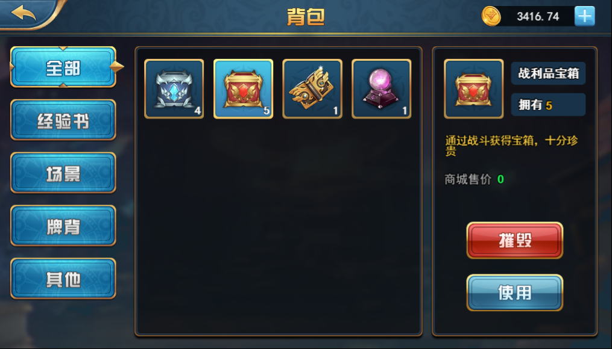

### 回收

回收是在游戏内把卡牌**按照卡牌参考价转换成XWG，操作不可逆**。

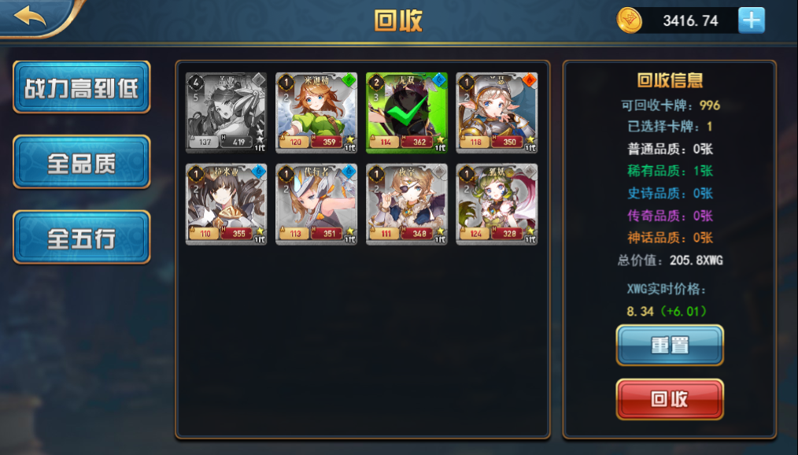

### **交易所**

点击按钮打开[NFT交易所外链](https://nft.xwg.games/)，玩家可以在交易所购买或出售链上的卡牌。

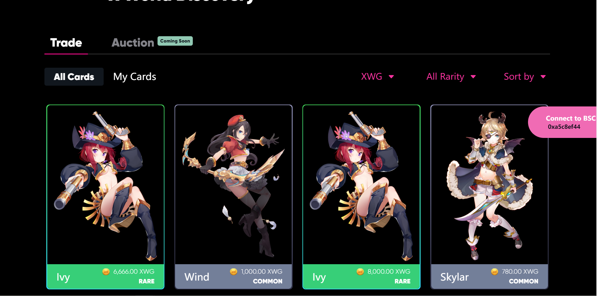

### **羁绊**

展示游戏内**所有的羁绊数据**，包括羁绊图标、羁绊组成及羁绊效果。

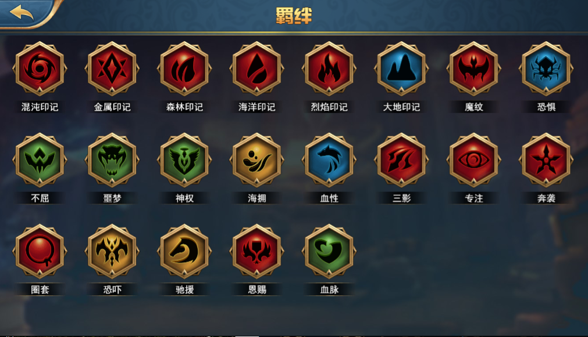

### **排行榜**

排行榜分为**财富榜、战力榜（待开发）、胜率榜**。分别按XWG、出战卡组战力和总胜率来进行排名，显示前100名数据。待后续奖池开发完毕后，会根据排名给予相应的XWG奖励。

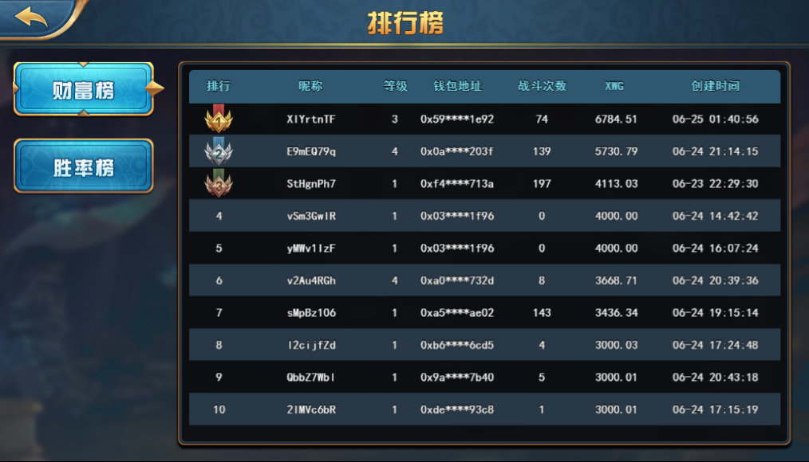

### **对战记录**

对战记录会显示当前玩家所有的对战记录，方便查询对战信息。

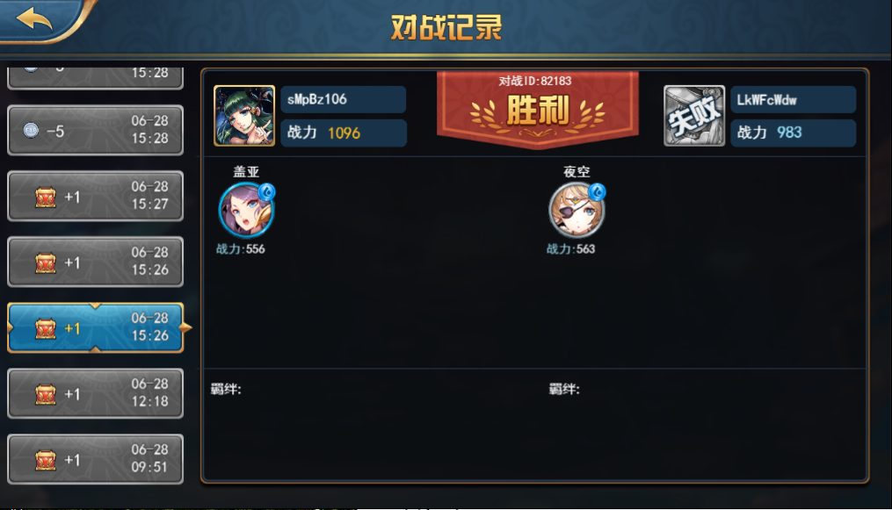

### **设置**

玩家在设置界面可以进行查看账号信息、更换头像、设置音效、退出登录等操作

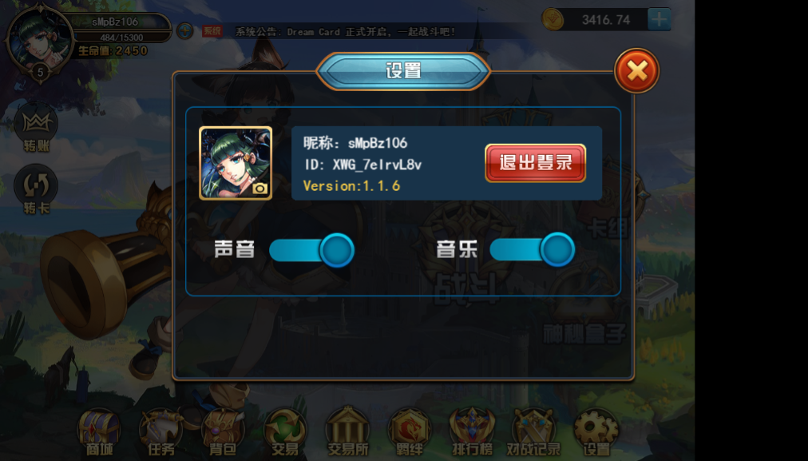

### **神秘盒子**

神秘盒子是游戏内卡牌的主要来源，分为十连抽和单抽（待开发）。玩家可以查询奖池所有的卡牌信息及抽奖概率。

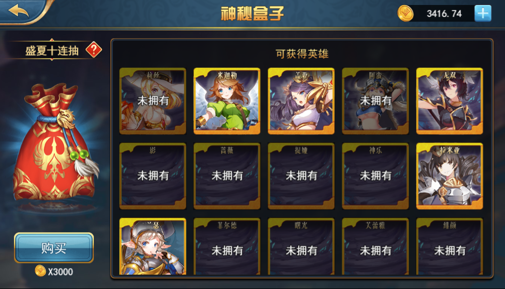

### **卡牌**

卡牌界面展示玩家当前拥有的所有卡牌。单击卡牌可以展示该卡牌基础属性、技能属性、羁绊属性，而且还可以对卡牌进行升级、升代操作。

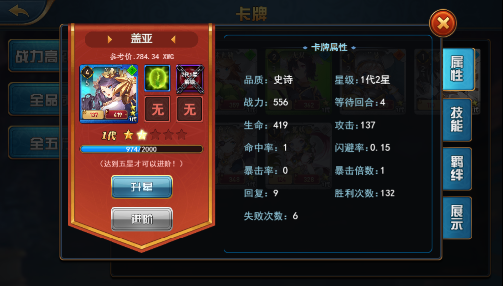

### **卡组**

卡组界面展示出战卡组的所有信息，并且可以对卡组进行卡牌配置。

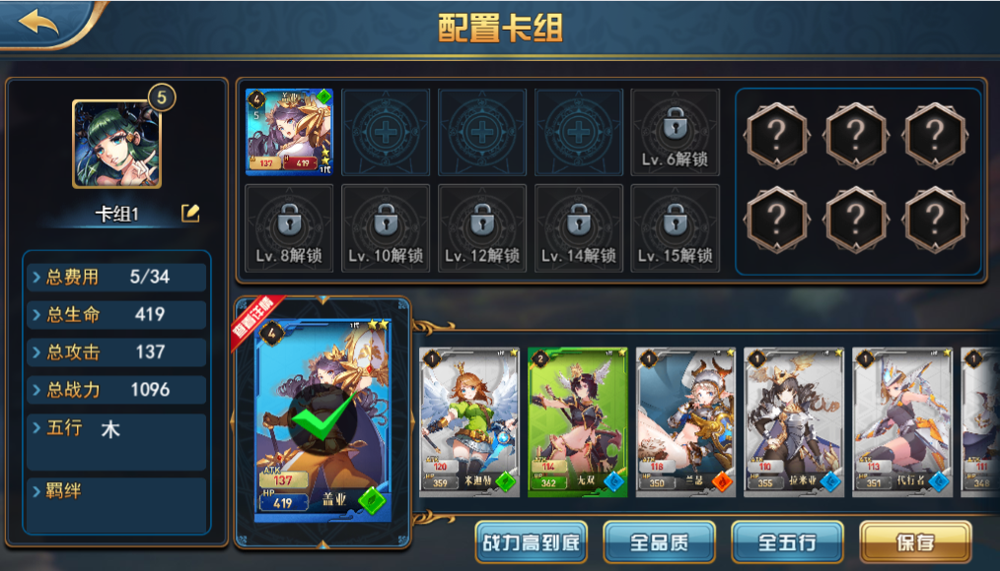

### **战斗**

点击战斗按钮即可进入战斗匹配队列，按照出战卡组的战力进行匹配。

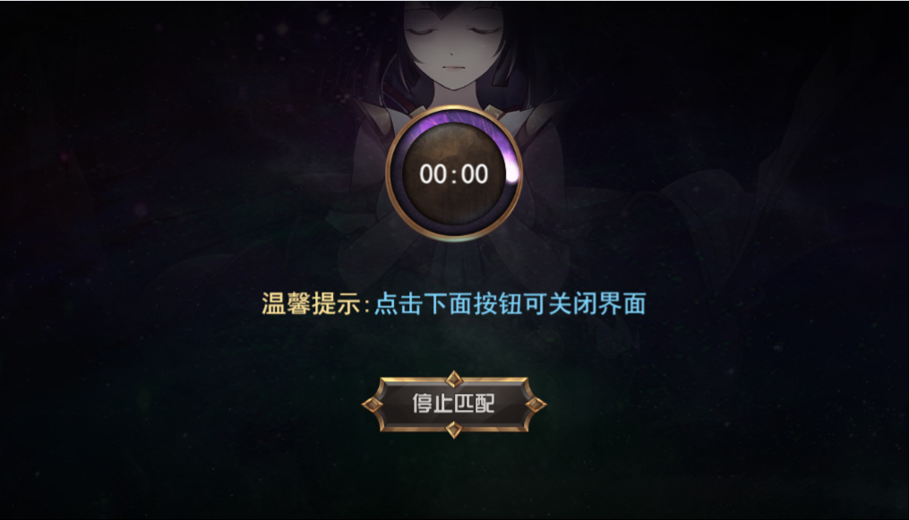

### **远征**（待开发）

玩家可以通过远征功能把链上卡牌进行远征质押，根据卡牌的类型分为普通远征和创世远征。根据卡牌参考价和质押时间获得相应的XWG质押奖励。


## 以下为待开发**：**


### **天梯**（待开发）

天梯按赛季，以离线战斗，名次互换方式进行。玩家通过支付一定金额的报名费参加天梯比赛，在赛季结束后按照玩家的天梯排名进行XWG奖励。

### **奖池**（待开发）

设置一个大额的奖池，对一些排名类的板块进行奖励，达到促进游戏活跃的目的。奖池来源分为原始矿池挖矿和玩家战斗失败掉落两部分。

### **推图**（待开发）

设置一个推图板块，全天开放。玩家以PVE的形式闯关卡，完成一定数量的关卡可以获得XWG奖励，达到促进游戏活跃的目的。奖励来源从活动矿池里面支出。

### **世界BOSS**（待开发）

设置一个BOSS板块，每天限时开放。玩家以PVE的形式攻击世界BOSS，击杀世界BOSS后按照击杀贡献比例对玩家进行XWG奖励，达到促进游戏活跃的目的。奖励来源从活动矿池里面支出。

