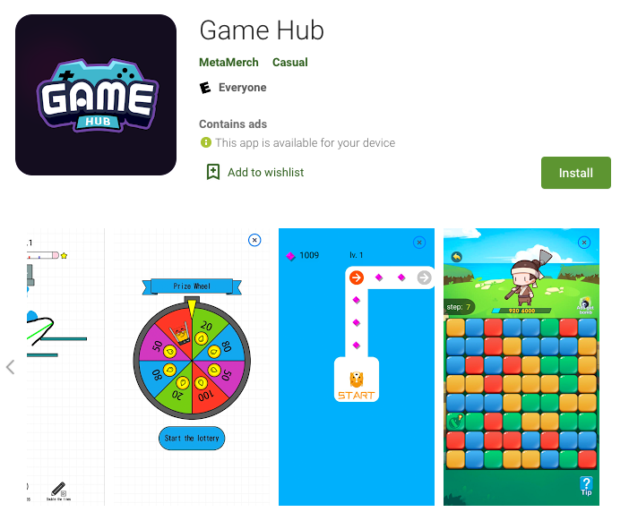

# 🎲 Fungames

### When Play-to-Earn meets Mini-Games

**Game Hub** is XWG’s casual mini-game center collaborated with ecosystem gaming partner. Guess what happens when play-to-earn meets mini-games? It provides great fun without the complicated game-play mechanisms that could be demanding and removes player learning-curve setbacks. It even comes with one-hand mode!

XWG’s GameHub mini-games are a successful time confetti product. The games are not only easy to play but small in size. Players can generate $XWG with their passive accumulated playtime.

Download [Game Hub](https://xwg.games/#/gamehub) from X World Games to earn $XWG today!

