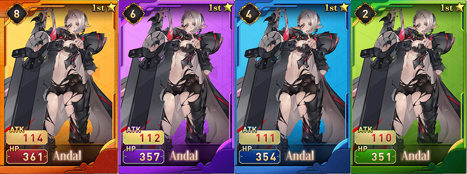

# ♥ Dream Card

The XWG Dream Cards (NFTs) are released in BEP-721 format. Each Dream Card has qualities, elements, techniques, HPs, ATKs, levels, and other features, which are assigned based on exclusive IP either developed by the XWG team or third-party partnerships, so that each Dream Card has uniqueness and collection value. Dream Card NFTs now can be cross-played in Dream Card v1 & Dream Card v2 and participated in the X Pool staking events.&#x20;

## **How to Purchase Dream Card?**

Players can now acquire Dream Card from [X Marketplace](https://app.xwg.games/#/) or through third-party partner NFT marketplaces, listed as below:

📎 [BinanceNFT](https://www.binance.com/en/nft/collection?orderBy=list\_time\&orderType=-1\&isBack=1\&id=508700038943432705\&order=list\_time@-1)&#x20;

📎 [OpenSea](https://opensea.io/collection/dreamcardbimbos)&#x20;

📎 [Mintverse](https://www.mintverse.com/collections/collection/15507)

📎 [Refinable](https://app.refinable.com/collections/dream-card?sort=listedAt+DESC\&tab=all-items)&#x20;

📎 [TofuNFT](https://tofunft.com/collection/dreamgame/items)

📎 [NFTrade](https://nftrade.com/assets/bsc/0xe6965b4f189dbdb2bd65e60abaeb531b6fe9580b?traitIds=)

📎 [Ivy Market](https://ivymarket.io/account/0x9D49277ff83fe25869952041d8F2Cf72efcDbbbA/0)

