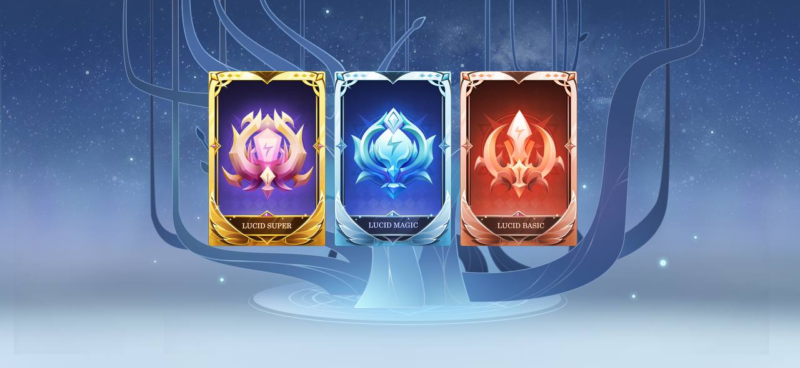

# 🃏 LUCID Token


Lucide contract: [https://bscscan.com/address/0x93a1c932f2dEc6A3CA55A8b3eDd5D541958BD156](https://bscscan.com/address/0x93a1c932f2dEc6A3CA55A8b3eDd5D541958BD156)


X World Games is excited to unveil the newest [**BEP-1155 token**](../../service/blockchain-101/bep1155.md) asset — **LUCID.**

LUCID will be the **primary** **play-to-earn reward** asset throughout the ecosystem. As X World Games enters the next phase of external gaming integration, the single-token economy model won’t be fit and inclusive enough to embrace the whole gaming metaverse. Therefore, LUCID will be the new incentive of Play-to-Earn and pave the path to XWG’s latest introduction of the **Play-to-Earn-to-Stake (P2E2S)** economic model.

****

### **What is LUCID? How can I earn it?** 

Players can earn LUCID from playing games on the X World Games multi-gaming platform. Rewards can be generated from **loot boxes** to single-match wins. **LUCID will have three types of rarity: **<mark style="background-color:purple;">**Basic, Magic, and Super**</mark>**.** The higher rarity ones will have a smaller drop probability and only can be obtained via holding higher-level characters or completing higher-level chapters.

### **LUCID Utilities**  

#### **Boost to earn XWG tokens** 

LUCID will be the <mark style="color:purple;">**crucial**</mark> and <mark style="color:purple;">**required**</mark> <mark style="color:purple;"></mark><mark style="color:purple;"></mark> fuel for staking with the X Pool. Players must consume a certain amount of LUCID while staking their Dream Cards to earn $XWG tokens. The staking mechanism with LUCID is now attached to the length of time staked, which means the more LUCID a player consumes while staking, the longer period that player can stake.

#### **Upgrade Dream Card rarity**  

Similarly, LUCID token will be consumed for our new DreamCard upgrade mechanisms: <mark style="background-color:purple;">Evolution</mark> & <mark style="background-color:purple;">Fusion</mark>.

Players can craft higher rarity with the required amount of $XWG tokens, LUCIDs, and DreamCards, they would like to upgrade through Evolution. To craft higher rarity DreamCards (i.e., Legendary or Mythic) will need higher rarity of LUCIDs — the Magic & Super.

The asset Shard will be the primary consuming token for the Fusion mechanism, which we’ll discuss in the coming introduction.

### **Why are we switching to LUCID?** 

LUCID will gain dominance and become XWG’s primary play-to-earn reward asset, while the $XWG token will lean its attribute more towards being the <mark style="background-color:purple;">XWG governance token</mark> (DAO token). Hence, XWG will have a more adequate and sustainable economic design to ease the token inflationary pressure and bring more possibilities for making financial adjustments. A key point to address is whenever LUCID is consumed, it will be burned and thus removed from the supply.

With the new changes and the addition of LUCID, the X World Games ecosystem is becoming more complex but dynamic. These changes will promote healthy and vibrant economic growth in our earning scheme, tokenomics, and player userbase.

\
