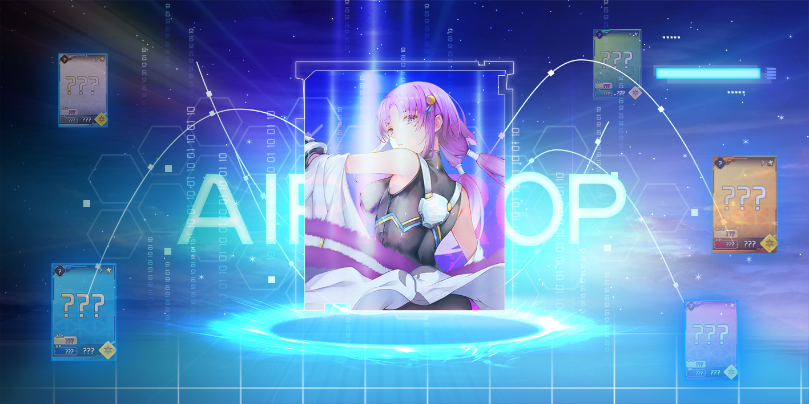

# 🗃 NFTs

**Non-fungible tokens or “NFTs”** are unique digital assets stored on a blockchain. While most NFTs are artistic endeavours, with the rise of “play-to-earn” games on cryptocurrency blockchains, in-game items have also become available as NFTs.

With Dream Card v1 and v2 (and soon v3), X World Games has minted a variety of NFT assets unique to the XWG gaming metaverse on the BNB blockchain. These assets include our _**Dream Card NFTs, LUCID, and SHARD**_, our new BEP-1155 token assets that will become our primary play-to-earn reward for the XWG ecosystem.

Our _**Dream Card NFTs**_ consist of hero characters for our Dream Card game series. Players can use these NFTs to either create powerful decks in which they can battle other Dream Card players or use their Dream Cards to play in a PvE game mode by clearing chapters and defeating monsters. With more games in the works, X World Games will reimagine NFTs and how players can use them in the ecosystem.

_**LUCID**_ and _**SHARD**_ are our in-game token and NFT-like asset, the primary reward in our new play-to-earn model. With the introduction of these two new assets, the XWG team has developed a brand new GameFi economic model, “Play-to-Earn-to-Stake” (P2E2S). For players who wish to participate in our staking pools, LUCID must be consumed to earn XWG tokens. SHARD is a resource for players to use when participating in our new Fusion mechanism, a card crafting mechanism where players can craft higher rarity Dream Cards.

### **What is BEP-1155?** 

BEP-1155 is the multi-token standard that combines the fungibility of BEP-20 and the non-fungibility of BEP-721 in one contract, which finds a middle ground of fungibility-agnostic and gas-efficient (yes, cheaper gas!).

With a single BEP-1155 contract, users can deploy a token economy with fungible (tokens) and non-fungible (NFTs). Crypto projects like Axie Infinity have adopted similar models incorporating BEP1155 and multi-asset / token smart contracts into their gaming tokenomics.

BEP1155 in the X World Games will be an NFT-like asset that can be traded across **all NFT marketplaces**, like Opensea, Looksrare, and our official X Marketplace.

