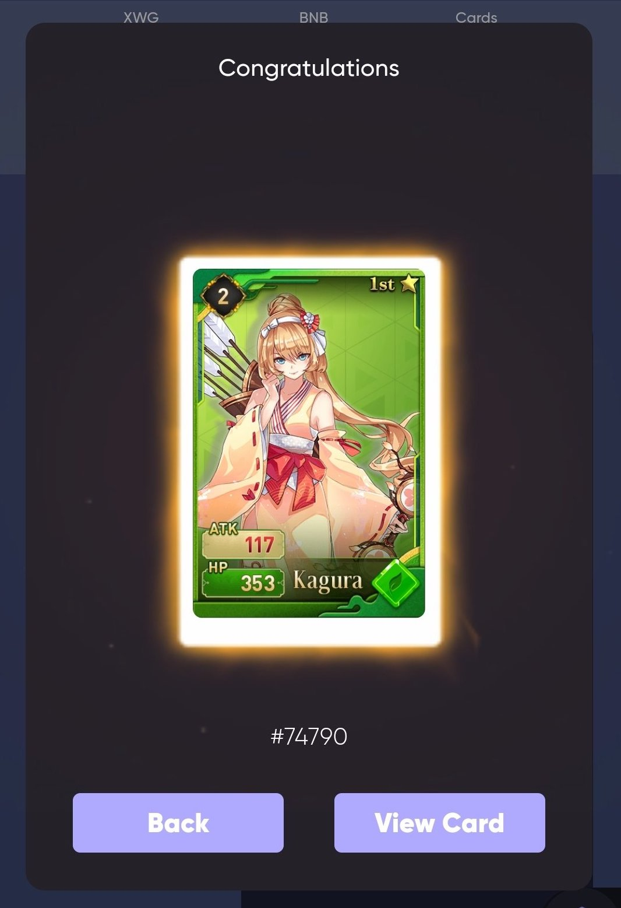

# How-To Evolution

**Mechanic:** Dream Card Evolution will allow players to be able to evolve their Dream Cards to a higher quality by sacrificing a base amount of lower quality cards.

**Rarities:** Players will be able to obtain any Dream Card from Rare to Myth rarity (provided they have enough base cards for Evolution).

**Evolving your Dream Cards:**

Access the Dream Card Evolution page by going to https://xwg.games, clicking “Fusion” on our navigation bar at the top, and then selecting “Card Evolution”.

You will then be shown the following menu:

1. Click on “Select Rarity” to pick what rarity of Dream Card you would like to create.

You will then be presented with the following Evolution options:

&#x20; 2\. Next, choose which Dream Cards you would like to sacrifice by pressing “Add Cards”.

You will then be shown a menu where you can select which Dream Cards. Confirm the 5 Dream Cards you wish to combine to evolve your higher rarity Dream Card.

Congratulations! You have received a new Dream Card using our Evolution mechanism.

