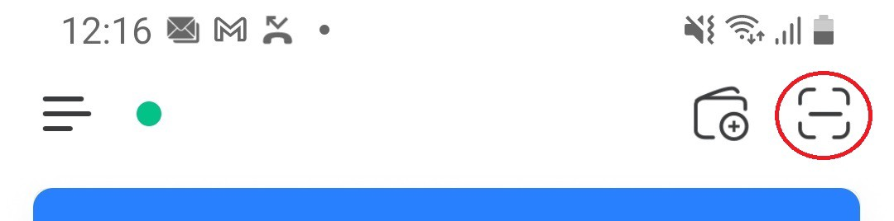

# \[How-To-Play] P2E Research: Login Issues XWG Dream Card V2 (Update)

All basics about this topic you find in my first article:\
[P2E Research: Login Issues XWG Dream Card V2 (Troubleshooting)](https://medium.com/@cap1osmokaess/p2e-research-login-issues-xwg-dream-card-v2-9bba26139820)

In the following I will tell you a 100% solution and I will describe the common login troubleshooting again because there are some changes since the last update.

### The solution (if you have the resources) — Another phone or tablet 

The solution (if you have the resources) — Another phone or tablet

I suggest to go this way if you have another device that can rund Dream Card V2.

In my first article I wrote a lot about the issue and what could cause it. And using a second device eliminates all these at once. So do it as described in the following:

* Install Token Pocket on your main device (phone or tablet)
* Install Dream Card V2 on your second device
* Start the apps on both devices
* In Dream Card V2 select “Wallet Connect” as usual
* Then choose tab “QR Code” instead of “Mobile”

* A QR code to scan should then appear
* In Token Pocket press the button to scan a QR Code and scan it

* Confirm auth and login after that without issues

If you do it like this everything concerning transactions and confirmations pops up instant and everything works smooth and steady.

### The troubleshooting (if you have to run both apps on a single device) 

### Working in most cases but uncomfortable 

Restart your device! Caches are cleared, apps are stopped…I am not sure why, bit it solves the problem in most cases.

### The common try and error to get in 

_“TP” = Token Pocket_

_“DC” = Dream Card V2_

I am usually doing it in a frequently procedure and this looks like this:

1. Open “TP”
2. Go to start screen
3. Open “DC2”
4. Connect wallet like usual and go back to “DC2”
5. Close wallet balance view and wait for main screen
6. Press main screen -> “TP” opens and so on…
7. !!! If no login confirmation pops up !!! and do….
8. !!! NOTHING (don’t switch manually to “DC”) !!! Wait one or 2two minutes (the time “DC” needs to load up to 100%).
9. _\*Optional\* If whitelist is enabled you can disble it and enable it again. After that you have to enter your password again, this sometimes helps._
10. After the waiting time from step 8 has passed switch to “DC” again
11. Press main screen again -> If it worked “TP” does not pop up, you see “Loading…” and the girl runs.
12. Press the X World Logo crown (don’t switch manually to “TP”), pressing the crown trigger “TP” to pop up with the password login confirmation window.

If your whitelist was initial enabled after step 8, there is also another possible solution. This needs more time, but it seems that it can also help:

1. In “TP” Disable whitelist
2. In “TP” go back and press the red exit button to disconnect the wallet
3. Switch to “DC”
4. Close “DC”
5. Start from the beginning above at step 1

\

_`Content Creator:`_[cap1osmokaess](https://community.xwg.games/u/cap1osmokaess)

_`Link:`_ [_`https://community.xwg.games/t/how-to-play-p2e-research-login-issues-xwg-dream-card-v2-update/369`_](https://community.xwg.games/t/how-to-play-p2e-research-login-issues-xwg-dream-card-v2-update/369)_``_
