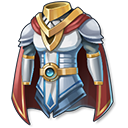
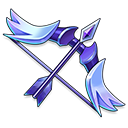
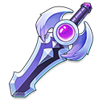
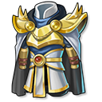

# Game Features

Lottery

Dream Card V2's Lottery feature is a brand-new design and first of its kind in crypto games- upon completing each and every level and regardless winning or losing, players will get a chance at winning a lottery for their lucky draw at the Prize Pool.

NFTs

Dream Card V2 comes with a versatile NFT feature that provides players with various NFT owning options based on their personal preferences. Dream Card V2's NFTs expand beyond the game cards and ranges from a chapter's monster to a piece of land or a set piece in the plot; such purchases would in turn benefit players with lasting revenues generated by and in positive correlation with the game plots playing volume.

.png>)

Gears

   

Heroes in Dream CardV2 can employ gears in two categories: weapons and outfits.&#x20;

Each class owns its exclusive and unique gears. Equipments can be obtained through Mystery Box opening or game chapter clearance.&#x20;

Gears are divided into 5 qualities in white, green, blue, purple, and orange from low to high. Gears can be upgraded by burning lower quality gears, the upgraded gears get to keep the burnt gears' experience.&#x20;

Gears can significantly boosts heroes' attributes and can be traded on the marketplace.

