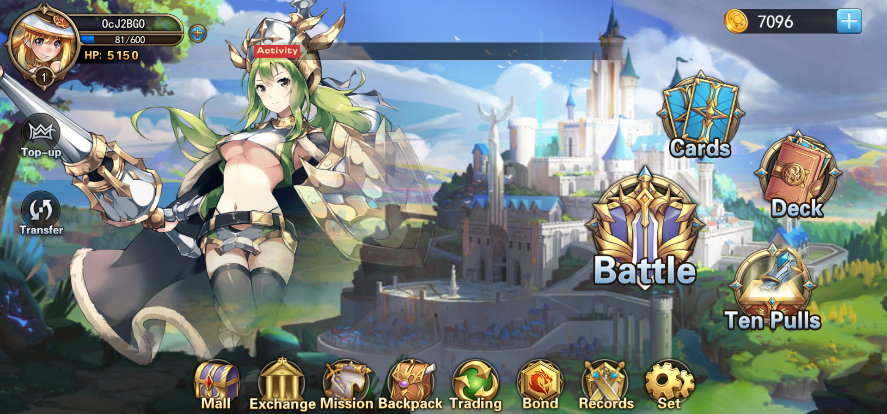

# Dream Card



在X World Games生态内发行了第一款游戏为《梦幻卡牌Dream Card》，这是X World Games 发行的首批的可收藏且可战斗的NFT卡牌，也是全球首个日系二次元的 NFT卡牌对战游戏。目前拥有梦幻卡牌的玩家人数超过6千万。

梦幻卡牌Dream Card其灵感来自于《Pokémon交易卡游戏》，结合了区块链的技术，在X World Games生态中，每一张NFT卡牌都被清楚，透明的记录在链上，并属于玩家。并且玩家可以对卡牌进行二次创作，增加了游戏的可玩性。

