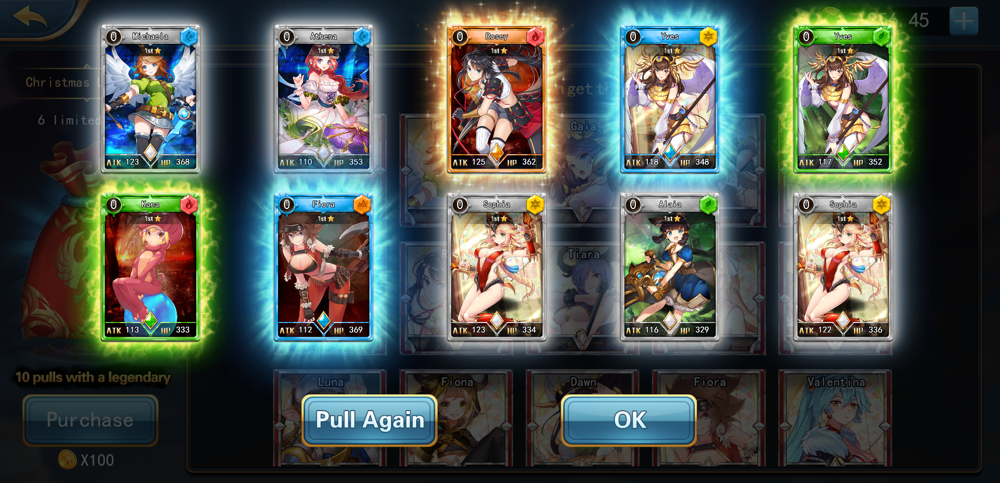

# Dream Card


Dream Card 游戏展示


在X World Games生態內發行了第一款遊戲為《夢幻卡牌Dream Card》，這是X World Games 發行的首批的可收藏且可戰鬥的NFT卡牌，也是全球首個日系二次元的 NFT卡牌對戰遊戲。目前擁有夢幻卡牌的玩家人數超過6千萬。

夢幻卡牌Dream Card其靈感來自於《Pokémon交易卡遊戲》，結合了區塊鏈的技術，在X World Games生態中，每一張NFT卡牌都被清楚，透明的記錄在鏈上，並屬於玩家。並且玩家可以對卡牌進行二次創作，增加了遊戲的可玩性。

