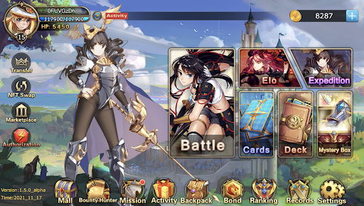

# 1⃣ Dream Card V1


Dream Card 1.0 Teaser


The first gaming product released on the X World Games platform was "Dream Card", also known as, "Dream Card V1". It was the first series of collectible trading cards issued by X World Games and the first global Japanese ACG-style NFT based TCG game. The number of players with TCG games currently exceeds 60 million gamers.

"Dream Card" was inspired by the famous "Pokémon Trading Card Game". The game combines the classic TCG battle functions and playstyles with crypto blockchain technology, creating a play-to-earn ecosystem. On the X World Games platform, NFT hero cards are transparently recorded on-chain, which means they can be openly bought and sold, and are non-fungible, belonging to a specific player. Players can customize their cards to have new attributes and designs, which improves the game's playability.

.png>)

**Dream Card V1,** the minimum viable product version of Dream Card, which mainly focuses on PVP gameplay, contains all the basic and functional elements of a crypto trading card game, such as a level & rarity system, character growth, ELO ranking, passive skills, and NFT staking & trading. Dream Card v1 was successfully launched in June 2021 and attracted more than 1 million+ players globally.
