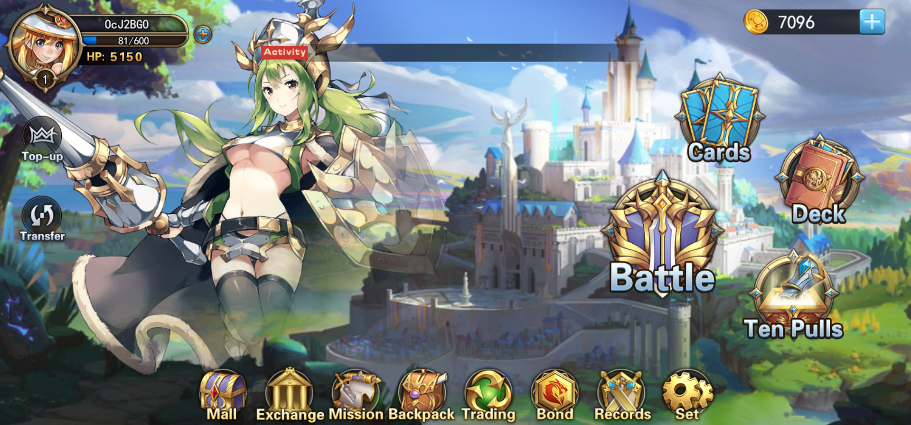
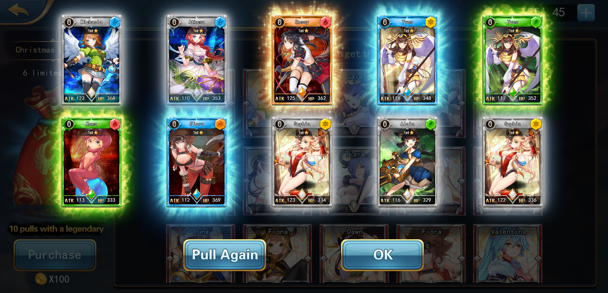

# Dream Card 1.0


Dream Card 1.0 Teaser


The first game released on the X World Games platform is "Dream Card," which is the first series of collectable NFT cards issued by X World Games, and it is also the world's first Japanese ACG style NFT TCG game. The number of players with TCG games currently exceeds 60 million.

Dream Card is inspired by "Pokémon Trading Card Game" and combines the technology of blockchain. In the X World Games ecosystem, every NFT card is openly and transparently recorded on the chain and belongs to a specific player. Players can customize their cards to have new attributes and designs, which improves the game's playability.

**Dream Card 1.0** is done by the minimum viable product approach, which mainly focuses on PVP gameplay, contains all the basic and functional elements of a crypto trading card game, such as level & rarity system, character growth, ELO ranking, passive skills, and NFT staking & trading. Dream Card 1.0 was successfully launched in June 2021 and attracted more than 1 million+ players all over the world.

