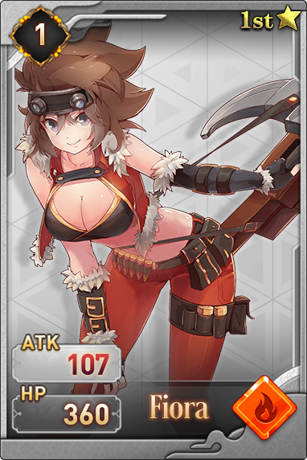

# Hero Characters

The XWG Dream Cards \(NFTs\) are released in BEP-721 format. Each Dream Card has qualities, elements, techniques, HPs, ATKs, levels, and other features, which are assigned based on exclusive IP either developed by the XWG team or third-party partnerships, so that each Dream Card has uniqueness and collection value.

In addition to the collection value of each Dream Card, XWG will also allow the holders of Dream Cards to use them to fight with each other in the XWG Arena, as well as to exchange them into XWG BEP-20 tokens.

Here, let’s have the character introductions of heroes in XWG Dream Card：

#### **1.Liz**

Liz, a mage from the Mortal Realm, had been striving for the Holy Godhead since her childhood. She worshiped witchcraft and loves adventures; although sometimes being reckless, she is self-righteous and enjoys helping others. After she met with Adeline, she realized that she could never surpass such genius in witchcraft. Hence, she began to train magic and martial duals instead. In the final battle of Godhead, she suddenly gave up, and it's all because Margot actually took over her soul.

#### **2.Michaela**

Michaela, as the defender of God,had consolidated the unique and supreme position of God through millions of years of battles and killings. Because of that, she became brutal and ruthless. Once, she was critically injured in the fight with Tiara, but luckily she was rescued by Adeline. Michaela and Adeline then became close friends who shared no secrets. However, Michaela still never wanted to reveal her true identity, God, to Adeline. The reason was that Gods should be merciful and gracious in Adeline's eyes, but Michaela was not one of them. When Tiara reencountered Michaela, they fought into a fierce battle again. This time,  Michaela consumed her life energy to cast the "Dance of Michaela," while Tiara was defeated, Michaela's Godhead was also burned out. After losing her immortality,Michaela had begun to strive to become a generous and great God.

#### **3.Gaia**

Gaia, the first God in the world who gave up Godhead, once served as the guardian of the Earth and had the strongest bloodline. She gave up Godhead because she witnessed relentless fightings from Michaela and others like her. So Gaia abandoned her ultimate weapon - the Red Slayer, leaving only the Holy Shield and the Holy Sword with her.

#### **4.Emani**

Emani, as a member of the Wild Stream Tribe, had been inspiring and extraordinary since childhood; unfortunately, her figure was slim.  To prove herself, she practiced martial arts very hard. With a coincidence chance, she received guidance from Isabella and which made her strength greatly enhanced. In addition, she met Rosey and got the Hornblade with Rosey's help.  Then, after sneaking into the depths of Fear Mountains guarded by the Wild Stream Tribe, she killed the Giant-horned Dragon-Lion, and gained the respect of the tribe. When she learned that Rosey was going to help her friends in the battle of Godhead, she also volunteered to go along with Rosey. She was a forthright warrior with an persistant will.

#### **5.Amoura**

Amoura, a warrior with magical immortality,  was the master of Rosey. All she wanted in her whole life was to train a successor who could fully inherit her skills. Luckily, she met Rosey. When she stumbled into the battles of Godhead, she accidentally found that she was in the same race as Tiara - God. Unlike Tiara, who was quite relieved after learning the truth, Amoura believed that God still had a unshirkable responsibility.

#### **6.Naomi**

Naomi, a shadow behind Siren, had never left her at any given moment because Siren accidentally saved her life in her childhood. Although later she realized the truth that Siren was not the one who saved her life, she still followed Siren and could not turn back.

#### **7.Rosey**

Rosey, formerly known as Senali, lived in the same village as Adeline. She followed with her master all over the world and began the training since the age of ten. After her accomplishment, she changed the name to Rosey and then started a long journey as a mercenary. She travelled around the world again, with a Lightning Blade in hand, and did everything just for money. Her dream was to build a self-owned legion, but she was tricked by Margot and accidentally involved in the battles of Godhead. After encountering Adeline by chance, she decided to help her childhood playmate to achieve her dream, but she never revealed her true identity. She was also the one who let all participants in the battle of Godhead realize that everything was a plan of the Margot.

#### **8.Tiara**

All people worshiped God and wanted to become God - but Tiara wanted to kill God. Thousands of years ago,  Michaela wiped out Tiara's tribe in a cold massacre. Tiara, the only survivor left, tried hard to seek for the Legend of Gaia and train herself in the long years. To kill God with God's way was her only goal. After obtaining the long-lost weapon - Red Slayer, her power was significantly increased, and then she started her journey of revenge. So far, Tiara is the only mortal who had ever defeated Michaela. During her ongoing acts of revenge, she had discovered that the extermination of her tribe was not that simple.

#### **9.Kagura**

Kagura, a witch in the Mortal Realm, was different from Adeline's specialism in magics and Liz's dual in magics and martial-arts.  Kagura developed a method of injecting spells into arrows due to her sickly physique since childhood. Therefore, mortals often debate that whether she or Wind was the strongest archer in the world. However, even until the final battle for Godhead, they had never fought face to face.

#### **10.Lamia**

Lamia, who carried an ancient bloodline, had always been the icon of Dawn. She had been outstanding and popular since childhood. She was beautiful, intelligent, kind-hearted and powerful. If Lamia had not announced her refused participation in the battle of Godhead, she might be the most promising one to replace the Guardian and become God. Still, she was fooled by Margot and accidentally joined the battles of Godhead, but she was also the first one who woke up consciously. Even though she knew about the truth behind Margot's master plan, she still maintained her good conscience and made worthy choices.

#### **11.Luna**

Luna, the princess of the Mortal Realm, was passionate about adventures. Luna never shouldered any country governance responsibility, and she just aimlessly explored around the world. Sometimes she fought against injustice, and sometimes she played tricks on local officials. Luna's heart was highly pure, and even Margot could not fool her. She was the only person who managed to make Margot unhappy. After an accidental involvement with the battles for Godhead, she became good friends with almost all the battle participants.

#### **12.Fiona**

Light and dark were never the only opposites, and those who use dark magics were not necessarily evil. Fiona was such an example. Because of one simple reason, her favourite colour of black, Fiona changed her mastery from light magics to dark magics and comprehended them extremely fast. She always travelled around like a forest ranger. She was a loyal friend of Rosey and Wind and a secret admirer to Adeline, who had mastered powerful light magics. However, after observing the red magics cast by Vivianna, she was convinced that chaos magics should not only contain red magics. So she determined to study blue magics, and unexpectedly obtained the Blue Light.

#### **13.Dawn**

Dawn, who carried an ancient bloodline, had longed for becoming a God since childhood. She had abandoned everything to practice martial arts for long 12 years, only for pursuing her path as an heir of the ancient bloodline. She and her families were afflicted with such a heavy mission, and although her name was Dawn,  she had not seen the sun in these 12 years.

    

#### **14. Fiora**   

Fiora, the strongest person in the Wild Stream Tribe,  was the only one who encouraged Emani and being a good sister to her in Emani's heart. She had killed countless monsters that escaped from the Fear Mountains and also been in a place full of the miracles of Gaia and Gods. However, she firmly believed that growth should not rely on external. So she refused to adopt Hornblade for growing her strength, and she criticized Emani for doing that. Although she participated in the battle of Godhead, she still protected Emani simply because she believed that people preserved their own values and should not attempt to become others.

#### **15.Valentina**

Valentina, a famous general in the Mortal Realm, had honoured countless battle achievements with a horrific long knife in her life. It's also her legendary experience that inspired the adventure for Luna. After unexpectedly discovering the existence of the battle of Godhead, her iron-blooded personality made her get into the fighting without hesitation. Michaela once said Valentina was the person who resembled herself the most.

#### **16.Ivy**

Ivy, a ranger in Mortal Realm, was a proponent of the battle of Godhead. Throughout her ranger travelling, she kept evangelizing about the battle of Godhead to anyone she had seen, but unfortunately, she missed the final battle of Godhead - the battle was already over when she arrived.

#### **17.Artemis**

Each generation of the messenger of God was called Artemis, and they had the supreme authority of all believers under the heaven. Wherever the land God had stepped, there would be God's clones in that place for a limited time. Artemis could summon these God's clones to fight with them. Artemis was forbidden to join the battle of Godhead. However, under the influence of Margot, Artemis of this generation understood that God's clones left in the world were limited, and one day they would be gone. So, it would be better to summon all of them at once, to absorb and accumulate their powers. By doing this, even though they could not be God, they could still become a Demigod. In the battle of Godhead, by acting as the most significant helper of the Margot, they constantly suppressed most of the participants - calmly and ruthlessly.

#### **18.Athena**

Athena, the hidden God in the world, had shown a powerful recovery ability of herself many times. Although her power was not low, she was not good at fighting. She liked all the beauties in the world but never couldn't understand why people wanted to become God. In God's world,  it was peaceful and quiet, and flowers would never wither, but all these seemed lifeless in her eyes. After encountering Michaela, who had lost her Godhead, she tricked Michaela a couple of times. She headed to the Fear Mountains after witnessed Kana's miracles.

#### **19.Skylar**

Skylar had always wanted to become the overlord of the sea, and the strongest Pirate King of the Nine Seas frontiers. She was also the first person who took advantage of Margot; when Margot tried to trick Skylar, she promised to give her a pair of secondary wings. As one of the most famous pirates, Skylar tricked her back and took the wings. To prevent Margot from retrieving the wings, Skylar managed to get the Night Whale's gall bladder from the Sea of Bitterness. Since then, she no longer needed sleep nor made dreams.  After the soul-taking from Liz, Margot's first thing to do was to seek revenge on Skylar.

#### **20.Kim**

As one of the most famous pirates, Kim was the greatest rival of Skylar for winning the Pirate King title. Kim's pirate ship was the fastest, so even though she had been through numerous battles, her loss was always the least. " Run if you can't beat them" was her winning motto. After seeing Skylar getting the mysterious wings, Kim was inspired to look for this kind of miracle, and that was why she decided to join the fight after learning about the battle of Godhead. Margot once tried to dream-controlled Kim to help her regain her lost wings from Skylar. However, Kim was highly defensive even in her dream, so Margot didn't have a chance and couldn't take advantage of her.

#### **21.Gigi**

Gigi, the spirit creature in the sea, hated pirates and had fought with many pirates before. Her best friend was killed with the sea urchin taken away, which caused her unstoppable fury, and she then turned the Nine Seas upside down. Gigi was invincible in the water. After following Kim, she decided to participate in the battles of Godhead, but her only purpose was to resurrect the night whale by becoming God.

#### **22.Yves**

Yves, the last witness of the battle of Godhead, was not supposed to join any fight as being one of God, but she kept on healing those injured ones in the battles, and no one would be dead. For this reason, people had no fear of joining fights. When she learned the evil plan of Margot through  Michaela's words, she tried to rise into the sky to search for rescue, but unfortunately, she was stopped by Margot. Although she did escape through the powerful aura, both of her wings were cut off.

#### **23.Isabella**

Isabella, the most famous one in Three Naomis, never hid herself from the world. All countries respected Isabella because of her relentless fighting for unfairness and injustice. She was dedicated to the search for miracles throughout her life. She was also the one who had always been skeptical about the battle of Godhead from the beginning. During the battle of Godhead, she revealed the true existence of Margot.

#### **24.Sophia**

Sophia, a native warrior in the Burning Flame Mountains, obtained the Dragon Flame Crystals from the inside of the flames and turned them into weapons. She desired to lead her tribe to the Land of Fertility. After learning the battle of Godhead from Ivy, she went there alone and later became a close friend of Fiora.

#### **25.Lucinda**

Lucinda, the entity condensed from the phantoms of demonic beasts that were killed in the Fear Mountains, had neither body temperature nor sense of pain. As she was always bloodthirsty and combative, after Emani and Fiora left the tribe, she went out of the mountains in a frenzy and killed everyone in the Wild Stream Tribe. Lucinda accused human-form fox spirits of forgetting their originality and fought fiercely with them. She didn't care about the battle of Godhead; all she wanted was to wipe out the Wild Stream Tribe.

#### **26.Blanc**

Blanc, coming from the vast grassland, was tough, sturdy, combative, and invincible. She had earned the most of honours in her tribe. Blanc had single-handed killed the iron-winged eagle and thorn-armoured beast. After hearing about the outside world from rangers, she headed out immediately by herself. She had crossed snowy mountains and seas, fought fiercely against pirate mercenaries, and was once favoured by Valentina, who wished to appoint her as a lieutenant. However, she refused. Later, Blanc decided to participate in the battles of Godhead for the simple purpose of meeting all warriors around the world.

#### **27.Margot**

Margot, the evil mastermind behind the extermination of Tiara's clan, was the one helping Tiara get the artifact in her dream.  God wasn't the only God, and humans were many, while Margot was the unique existence in the world.  She was initially close to humans and often indicated signs to sad people in their dreams for getting a better life. Nevertheless, people thanked God instead of her, so she finally became the frightening and full of hatred Margot. She bewitched countless people to join the battle of Godhead, and planed to dream-controlled the final winner who became God so that she can evolve herself into a mix-form of God and Demon. Margot's ultimate goal was - the extermination of both humans and Gods. She was born with four wings but lost two secondary wings due to Skylar's deception.  After cutting off a pair of Yves' wings, she imposed them onto her body and obtained supreme power from God and Demon.

#### **28.Adeline**

Adeline, as God's apostle, was a very talented witch in her village since childhood. She was kind, brave, and had a sense of justice. Her devoutness deeply influenced Michaela, who was combative throughout her life. Adeline formed a life-long bond with Michaela. Through the battle between Michaela and Tiara, she learned that a person's strength was also critical besides the spiritual gift, so she joined with Michaela and began a long journey of becoming God. Because Michaela knew some parts of the mystery, she helped Adeline access the "Heavenly Chant." Later, with her rapidly magic progressing, Adeline was known as the top mage of all mortals.

#### **29.Harper**

Harper, formerly known as Fuvi, had been serving Isabella as her loyal follower, and she gave herself a new name for this reason. She was aggressive, reckless and a bit insensitive. Isabella had few chances to reveal the truth of the battle of Godhead but failed because of Harper's trolls. After meeting Wind in the battle of Godhead, Harper saw Wind as her new idol, which was ridiculous and ironic. Although her strength was not enough, her luck was unbelievable. Wind wouldn't have a chance to found Kagura's dropped arrow if not because of her.

#### **30.Dina**

Dina, an excellent martial artist, had no clue how to teach or help her younger sister, Harper. She participated in the battles of Godhead just for the reason that she could help her sister to become God. In the end, she finally understood that everyone's destiny was different.

#### **31.Abigail**

Abigail, a member of a travelling circus, was bewitched by Margot and mastered a type of strange and weird magic. In the battle of Godhead, she once became a puppet of Margot, and then she regained her nature back after influenced by Aurora's red magic. With the help from Kana, she also released the people who were trapped in Margot's dream.

#### **32.Siren**

Siren, the land descendant of God and the gatekeeper of the battle of Godhead, was originally a snake with lightning speed and dual-specialized in poisoning and martial art. She was once a follower of Michaela, but she disgraced Michaela's idea of mercy God. Later, she found out that she was fooled by Margot and attempted to self-destruct to kill herself and Margot at the same time, but unfortunately failed. Because of her failure of gatekeeping, she was punished by the wrath from the heaven.

#### **33.Arya**

Arya, the most powerful one in the Three Naomis, was superior at both offensive and defensive strength. Arya had once fought with Rosey for three hundred rounds. Although there was no final win nor lose, anyone could see that she had the upper hand and should be the one winning. Arya was the most faithful believer of Gaia and the inherent of Gaia's ancient blood, also known as the most promising person to win the battle of Godhead. However, she carried too much responsibility, which caused her unable to be open-minded. During the battle of Godhead, Arya's stubbornness and ignorance of others eventually let her fell into Margot's trap and lost her ancient blood, but this also created a chance for Wind to shoot Margot. She was a contradictory person.

#### **34.Alaia**

Alaia, initially named as Aya, always wanted to become one of the Gods and changed her name to Alaia. Although she was not skillful in magics and martial arts, her research and development expertise was very impressive. Through crafting equipment and weapons, she had been able to overcome all the difficulties in the way.

#### **35.Cardi**

Cardi, the warrior from the Land of Barren and Golden Canyon, was a brutal and arrogant warrior,  eager to lead her tribe to the Land of Fertility. She had mastered two miracles of Gaia, and her strength, defence and speed were all well-balanced.

#### **36.Quinn**

Quinn, a spiritual creature in Fear Mountains, was originally a wild beast. Quinn had fought with Fiora several times. By accident, Quinn tainted Kana's aura during Kana's transformation into human form, which she gained all the human wisdom and intelligence and started to have curiosity about the world. After she learnt that she could become human and even God, she joined the battle of Godhead for the blessing of other spiritual beasts. Because of her aura, she was targeted by unfriendly Fiora. During the battle of Godhead, the two just fought directly from the beginning to the end, making the whole battle looks like their own one-on-one fight.

#### **37.Vivianna**

Vivianna, a warm-hearted warrior, lived in the Land of Frozen. Many adventurers had received her helps while in the Land of Frozen. Although she lived in such a bitter and cold place since young, she had never thought about moving. The reason she wanted to join the battle of God was that she wanted to prove magic was useless in front of absolute power. Vivianna was indeed a straightforward and powerful person.

#### **38.Wind**

Wind, one of three Naomis, possessed with the best archery n the world. She was quick, acted swiftly and sometimes vanished like shadows. Wind was a good friend of Tiara and once helped Tiara to fight against  Michaela. After knowing the truth of the extermination of Tiara's tribe, she travelled through the mountains to tell the heart-broken Tiara and helped her out from the bottom of the depression. Wind was a trustworthy friend. In the battle of Godhead, she found an arrow engraved with spells, and she shot Margot with the arrow and made her visible.

#### **39.Aurora**

Aurora, a mage in the Mortal Realm, was the older sister of Liz. She really hated Liz's duals in magics and martial arts and swore that no one could stop her from becoming God. Aurora self-comprehended the red magics from light and dark magics and considered everything as chaos.  She was very arrogant. Although Aurora looked down on her younger sister, she still loved Liz more than anyone else, and only she can bully her sister. She gave up her desire to become God after hearing Michaela's story, knowing that she would forget her feelings and attachments to Liz. Eventually, she deiced to carry forward and extend the red magics.

#### **40.Kana**

Kana, the spiritual creature of the Fear Mountains,  possessed a powerful restoration spell - the aura of life. With Kana's help, Emani found the magic tips to defeat the Giant-Horned Dragon-Lion. She really liked her name given by Emani, so she wanted to train to achieve a complete and independent human form; in that way, she could accompany Emani with her journey. Because she had seen Fiora killing countless creatures and beasts, she was afraid of Fiora, but she didn't know that the name of Kana was actually Fiora's nickname.

