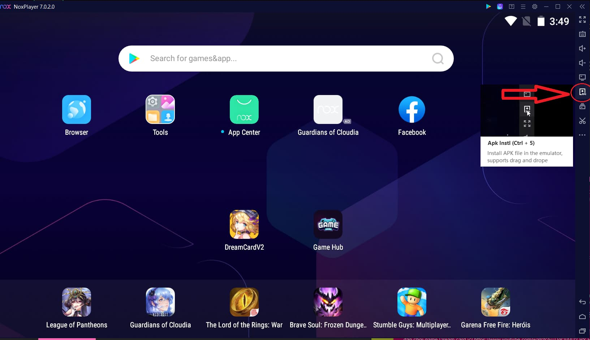

# \[How-to-Play] How to play DreamCard V2 - A step-by-step guide

### **First steps - Creating a wallet and downloading the game**

Dream Card V2 as any other blockchain game, requires the use of a crypto wallet to work, currently the only working wallets are [Token Pocket](https://play.google.com/store/apps/details?id=vip.mytokenpocket\&hl=en\_US\&gl=US) and [Safepal](https://play.google.com/store/apps/details?id=io.safepal.wallet\&hl=en\_US\&gl=US), both can be found on the android appstore but for this guide we will be using Token Pocket.

You can get more details on how to set up your Token Pocket wallet [here ](https://www.coincarp.com/learn/how-to-use-tokenpocket-a-beginners-guide/)(2).

If you already have another wallet, like Metamask for example, and you want to use it you can backup your wallet seed phrase on Token Pocket to have access to your already own assets.

Now with your wallet set up and ready to go it’s time to download the game, right now the game works both on android phones and android emulators ([Nox ](https://en.bignox.com)(1) and [Bluestacks ](https://www.bluestacks.com)(2) both works fine) you can find a direct download of the APK [here ](http://dc2download.xwggames.com/Apk/DreamCardV2\_2\_0\_2\_2022\_2\_17.apk)(1), on android phones it’s as simples as running the APK and installing it and you’re good to go, for emulation I will use Nox as an example, after you download the APK on your computer, open Nox and click the following button:

This will open a window, all you have to do is navigate to where you downloaded the APK and select it to install, you can also just drag and drop the APK file into Nox window to install it.

### **The game - Logging in, game UI and Gameplay**

So you finally have the game installed and running, cool, what to do from here? well after you start the game and wait for it to load, you will be prompted to the following window:\

[tutorial 21625×921 51.6 KB](https://aws1.discourse-cdn.com/standard10/uploads/xwg/original/1X/822c576badfec6e7ac611e6d136c2121404c7306.png)

If you are on android just click connect, this will open Token Pocket requiring you to authorize the app, after authorizing, close wallet connect window on the game by taping the X on the top right, then tap the screen, this will give you another prompt on your Token Pocket to login, confirm it and you’re good to go.

For VM user the process is a little different you will need to click the QR code option on wallet connect, this will generate you a QR code that you will need to scan on Token Pocket on your android phone (DO NOT use your wallet inside the emulator, besides the obvious security concerns it probably won’t work), the QR code reader is on the top right of the app main screen, it’s easy to miss:\

[tutorial 3881×1593 122 KB](https://aws1.discourse-cdn.com/standard10/uploads/xwg/original/1X/0ebc612712c81dc6d516709dd8ca46a02b653ab0.jpeg)

After you read the QR code, it’s the same process, authorize the app and login.

Now that you are officially on the game, let’s talk about the UI, for this part I will use images to help you understand where everything is and what it does, I hope the images don’t get too blurry…

First let’s talk about the main menu, after that I will go through each of the important parts of the game:\

[tutorial 41597×929 197 KB](https://aws1.discourse-cdn.com/standard10/uploads/xwg/original/1X/d206cf301c37247c3239e83c36b401254d66b2d9.jpeg)

Here as you can see we have access to all the major part of the games, I will go through each of them as we go forward, you can see your BNB balance and XWG balance on the top, our first stop will be the hero section:\

[tutorial 51591×919 212 KB](https://aws1.discourse-cdn.com/standard10/uploads/xwg/original/1X/06fc912f2ab73a2307efef5b7fd86a85f4f85309.jpeg)

Here you can see all you cards, to play Dream Card 2.0 you will need cards, you can start with as little as one card, but it’s recommended to have at least 7 to make an entire team, if you don’t have any card yet you can either go to the [marketplace](https://app.xwg.games/#/) and buy it from other players or [draw a box](https://app.xwg.games/#/pages/index/mystery) and test your luck, now back to the hero section, here you can see your cards model as well as their details and upgrade them, for that tap on details on the bottom left, it will give you this screen:\

[tutorial 61587×887 155 KB](https://aws1.discourse-cdn.com/standard10/uploads/xwg/original/1X/bcfedb34c1b73d71232bbc8dc4d3fb9d11f064fb.jpeg)

On the right you can see your card stats and skill, the “+” stats represents the bonus stats given by equipment, be sure to read your cards skill since it has great impact on the gameplay, the symbol on the left of the card name represents their classes, cards can have one of the five following classes: Knight, Assassin, Archer, Mage and Priest, each of them specialize in something different, to make it quick: Knights focus on defense, Assassin single target damage, Archers sustained damage, Mages debuffs and AoE, Priests cure, it’s important to keep that in mind when making your formation later on.

With that explained let’s see the other tabs starting with ascend:\

[Tutorial 71596×929 160 KB](https://aws1.discourse-cdn.com/standard10/uploads/xwg/original/1X/69510f71de174fc11689d2752e0b6a73c4b2a5c2.jpeg)

Here you can upgrade your card, all you need to to is select how much stars you want to upgrade and tap ascend, this will cost you XWG and the price of upgrading goes up the more XP you need, upgrading the cards will give you better base stats and each generation (6 stars) you go up your skills will gain a level too making it better, also upgrading here and in V1 has the same effect, so it carries through both games and on staking pools too.

Now for the final tab here, the equipment section:\

[tutorial 81601×930 155 KB](https://aws1.discourse-cdn.com/standard10/uploads/xwg/original/1X/4f7bdcc6089d2ccec0b313b1592f3e2b77e106da.jpeg)

Here you can equip weapons and armor for your card just tap the weapon or armor slot on the right to equip or remove it, I will enter in more details about equipment shortly, all you need to know now is that equipment are super important to make your cards strong, since it boosts your card defensive and offensive stats dramatically.

With that we finally ended the hero section walkthrough, now let’s take a look on the equip section, this one is quicker to explain:\

[tutorial 91593×927 151 KB](https://aws1.discourse-cdn.com/standard10/uploads/xwg/original/1X/3686b607409a959e371abf55ea96bc041baf81c5.jpeg)

Here we see all our equipment, equips are used to boost our cards stats, as you can see each equipment has their own stats and a class restriction, meaning it can only be equipped by a certain type of card, they have rarities the same way as cards does which affects it’s base stats and stats growth.

Equips can also be upgraded the same way as cards just tap the enhance button:\

[tutorial 101594×927 97.2 KB](https://aws1.discourse-cdn.com/standard10/uploads/xwg/original/1X/7e0820c5256af83e2565bb1f51ddf1b6ee707191.jpeg)

Upgrading equips works almost the same way as upgrading cards, the only difference is that instead of using XWG you use either essence or other equips to upgrade it, you can get both by drawing equipment boxes on the mystery box section (at the time of writing you can only draw equipment boxes inside of DC V2), after upgrading your card it’s stats will get boosted.

And that’s all for the equip section, not as long as the hero one and simple enough to explain, now let’s take a look, at the talent section:\

[Tutorial 111594×925 126 KB](https://aws1.discourse-cdn.com/standard10/uploads/xwg/original/1X/cca5e9f3a4b6f55945ece3558289d599e60cc346.jpeg)

Talents are a new system in V2 similar to equips, but it raises your entire team stats instead of only the equipped card, the differential is that talents can only be obtained by playing the game as of today, unfortunately since it’s a new system I didn’t have any luck yet on treasure boxes to show you a more in-depth guide, but you can learn more about talents in this [article 1](https://medium.com/x-world-games/dream-card-v2-talent-system-introduction-e43049ce6910).

Before we see the treasure and lottery tabs I need to explain the adventure, in other words, we get to finally play the game, so head to the main section and tap adventure:\

[Tutorial 121600×897 155 KB](https://aws1.discourse-cdn.com/standard10/uploads/xwg/original/1X/f64dfb1795923c8e52ceb8636ea93c92dea68c96.jpeg)

here is where the gaming finally begins, so DC V2 works on the following manner, you get to play each part of the adventure that has 10 stages each, to unlock the next part you need to clear the previous at least once, so you play part 1, clear it, and now you have access to part 2 and so on, to play each part you need to buy a ticket with XWG:\

[Tutorial 131601×899 85.6 KB](https://aws1.discourse-cdn.com/standard10/uploads/xwg/original/1X/0e95d2b18028b4215121104b21b1f41766c09741.jpeg)

From here you click “need to buy ticket” and it will prompt a transaction in your wallet, keep in mind that each transaction cost fees in BNB so be sure to have enough BNB on your wallet and confirm the transaction.\
After the transaction is confirmed in the blockchain you will see the following screen on your game:\

[Tutorial 141602×897 120 KB](https://aws1.discourse-cdn.com/standard10/uploads/xwg/original/1X/4f86879ac5fcc6456e2f80663df8e7d2e4945a57.jpeg)

From here just click stage 1 and you will go to the formation screen:\

[Tutorial 151641×934 170 KB](https://aws1.discourse-cdn.com/standard10/uploads/xwg/original/1X/bee1fa64ca10add841b165aef9e764a5a87f7794.jpeg)

Now you select the cards you want to use on the stage, as I said previously you can use a maximum of 7 cards to play, with that done you click the repulse button and you will go into the game:\

[Tutorial 161601×901 148 KB](https://aws1.discourse-cdn.com/standard10/uploads/xwg/original/1X/c4fa008477d3ed4eec600ea52cbedb9b2e1b15bf.jpeg)

The game is an auto-battler so all you need to do is wait and watch your cards do the work, you can increase the battle speed tapping the bottom left button.

After that you need to clear all the stages to receive your rewards, but before that there is some things to note: you will need to pay for the ticket every time you want to play a part, you will not lose anything if don’t finish a part, it will remain open until you beat it, so take your time to upgrade your cards and equip, also, your wallet, cards and equips have a limit in how much times you can play, that’s what the number below deployed and “surplus physical strength” means, you won’t be able to play with that wallet, card or equip if it hits zero.

With that said, if you successfully finish a part you will be awarded with a treasure box, so head to the treasure section:\

[tutorial 171601×893 117 KB](https://aws1.discourse-cdn.com/standard10/uploads/xwg/original/1X/40680680d47c2b619a39ed7f6e1a750857eb3965.jpeg)

here is where you go to see your rewards, so the reward system function like that, you can only open your treasure chest after the round you played ended, each round last 8 hours, you can see how much time there is left before you can open your box in the “round refresh time”, after the round ends you can tap open, it will show how much XWG you earned at that round and a claim button, after tapping the claim button your wallet will prompt a transaction, again check if you have enough BNB for fees and accept, note that the XWG won’t go directly to your wallet you will need to go do the “adventure” tab again and claim it, also there is a fixated chance of you getting equips, talents and lottery tickets on the rewards chests, you can check the exact percentage after you enter a part.

Now lastly let’s talk about the lottery section:\

[tutorial 181637×933 137 KB](https://aws1.discourse-cdn.com/standard10/uploads/xwg/original/1X/3c102c49d9fc14b8b604f309a626f167ca17309e.jpeg)

Here you can see all your lottery tickets, they give you a random amount of XWG when you use them, after you accumulate enough you can tap on “get” to transfer it to your wallet, pretty simple.

With that I explained everything you need to know to play DC V2, hope you liked it and have fun.

_`Content Creator: Kioku`_

_`Link:`_ [_`https://community.xwg.games/t/how-to-play-how-to-play-dreamcard-v2-a-step-by-step-guide/363`_](https://community.xwg.games/t/how-to-play-how-to-play-dreamcard-v2-a-step-by-step-guide/363)_``_
