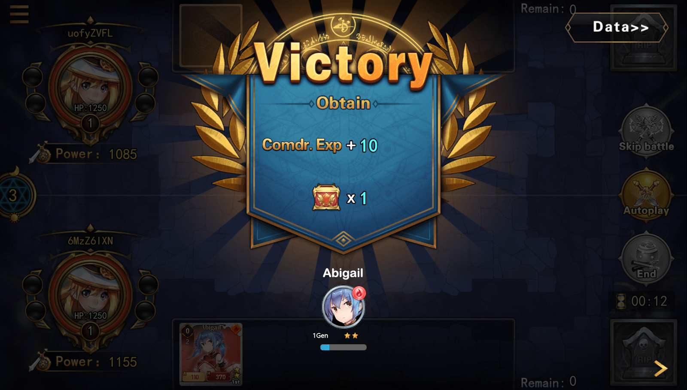

# Beginner's Guide

## What is Dream Card?

Dream Card is an NFT battle card game under the X-World-Games ecosystem. Each card has its own unique attributes. You only need to obtain a few cards, you can match and play against the world's players on the Internet.

The project is hosted on [GitHub](https://github.com/X-World-Games). All updates made to this page and all past versions of the rules are recorded here. In addition, the changelog on this page describes all rule changes between versions.

You can report issues and discuss changes on the GitHub Issues page or in the DAO on the X-World-Games official website.

DAO is a decentralized governance community, where you can discuss various rules related to the game and propose amendments. All players in the game community can vote on amendments.

## **Beginner's Guide**

### **Part 1 - Introduction**

#### **1.1 What is Dream Card？**

Dream Card is the first NFT TCG game released by X World Games - the decentralized gaming ecosystem aims to build a blockchain gaming metaverse. The dream cards are blockchain-based on the Binance Smart Chain and can be collected as NFT assets. Dream cards can be customized and grown into new characters with varying degrees of unique designs and compelling images, which lead to powerful combat attributes in the game and high-value collectibles in the market, and players are allowed to trade them freely in the NFT market, thanks to the true digital ownership by blockchain gaming.&#x20;

The game rules are similar to traditional card board games or online TCG card games. Players have to strategically construct a combination deck of cards and defeat with other players by consuming all opponent's cards.

This document can be used as a reference for the standard rules and instruction for novice players. Before starting the game for the first time, please read the content of this page carefully and prepare the tools you need.

#### **1.2 Login**

Dream Card can be played on both PC browsers (such as Chrome or Firefox) and mobile H5 pages. However, if you want to experience the fun of decentralized games fully, it is recommended to have:

Blockchain Wallets - like [MetaMask](https://metamask.io), [Binance Chain Wallet](https://www.binance.com/en/wallet-direct)

The digital wallet is managed as your private account to ensure the safety and security of all your digital assets (such as XWG tokens, NFT cards, virtual props) and recorded progress in the blockchain games.

#### **1.3 Mobile number or email**

If you don't have a blockchain wallet, you can use your mobile phone number or email to register and log in to the game, and your in-game data information will be saved locally. However, when you need to manage your in-game & on-chain assets, you still need to bind them with your digital wallet address.

If this is the first time you have heard of blockchain wallets, we recommend reading the [Getting Blockchain Wallet - Starter Guide](https://docs.binance.org/smart-chain/wallet/metamask.html).

**If you don't have a card to initiate the game, you have many options:**

#### **Airdrop Event**

The first airdrop event will be announced sometime after the game launch. First-time players can get a "common" rarity card for free during the event. For details of the event, please stay tuned with the official announcement from X World Games.

#### **Mysterious 10 Draw**

After entering the game, players can spend a small amount of XWG tokens to participate in the Mysterious Draw. Players will get ten cards and have a chance to win high-rarity cards.

#### **Mystery Box**

Under the [marketplace](https://nft.xwg.games) page on the [X World Games](https://xwg.games) official website, players can spend XWG tokens to purchase mystery boxes to get one card and have a chance to win high-rarity cards.

#### **NFT Trading market**

Players can sell their unused cards to the [NFT market](https://nft.xwg.games/pages/market/market), and other players can buy them with XWG.

### **Part 2 - Game Attributes**

Before entering the game, you also need to know the following:

#### **2.1 Commander role**

The role is your account and you are in charge of the card battle. This role has three attributes: level, life, and total cost.

**Level**: The commander level can be improved through combating or upgraded by purchased materials in the mall. The higher the level, the higher the life and total cost. In addition, the level can unlock the extra card slots in the deck and increase the number of cards can be used in the deck configuration.

.png>)

**Life**: In the card battle, a commander will have a specific amount of life to fight with the opponent.  When a commander's life is dropped to zero, the battle is concluded as defeated.

**Total Cost**: The total cost determines the number of cards in the deck.\

#### **2.2 **Card Attributes

#### **Quality (Rarity)**

There are five different rarities of cards in the game: Common, Rare, Epic, Legendary, and Myth, and each rarity is represented by a color. The higher the card quality, the higher the combat attributes and the number of skills players can have.\

| **Rarity**    | **Color** | **Max. Skill Slots** | **Combat Waiting Rounds** |
| ------------- | --------- | -------------------- | ------------------------- |
| **Common**    | White     | 1                    | 1                         |
| **Rare**      | Green     | 1                    | 2                         |
| **Epic**      | Blue      | 2                    | 4                         |
| **Legendary** | Purple    | 3                    | 6                         |
| **Myth**      | Orange    | 4                    | 8                         |

#### **Five Elements**

Each card has a fixed five-element attribute when it is generated. The five elements are Gold, Wood, Water, Fire, and Earth. They interact and restrain each other. Players can construct a powerful deck according to different five elements, and the bond effect can be triggered when a deck has all five elements grouped

#### **Star Level**

The star level of all cards initially created is 1st generation and 1 star. Players can use the experience book to increase the star level of the card. After reaching five stars, players need to use the advancement stone to upgrade the card. The highest star level a card star can go to is 3rd generation and 5 stars.

.png>)

#### **Skills**

Cards with **Rare or above** in rarity level will have access to skill slots. Skills can be unlocked by upgrading the cards to the corresponding stars. The skills and skill levels of cards will be randomly assigned. For more details on skills, please refer to [Skill Configuration Table](https://drive.google.com/file/d/16\_5uAJ6WgTdQRtC-yILUOQs4qembYLzF/view?usp=sharing).

#### **Bond Effect**

One of Dream Card’s game features, which is suitable for advanced players to configure deck strategy. Unique decks such as the five-element combination and hero character combination can trigger the bond effect, which takes effect during battle. The five-element combination bond effect is currently online. Please refer to the [Bond Effect Configuration Table](https://drive.google.com/file/d/1SOHJj\_I1xfk\_BqbPgSULBAYb3Kvwf7yE/view?usp=sharing) for the bond combination and effect introduction.

#### **2.3 Combat Attributes**

**Power**：which can be improved through card upgrading, the higher the power value, the greater the chance of winning；

**HP**：which can be improved through card upgrading, when the card’s HP value is 0, it will be removed from the battle deck；

**Atk**：which can be improved through card upgrading, the higher the attack power, the higher the damage value;；

**Recovery**：before the card joins the battle, its HP value will be restored once, the higher the value, the higher the HP can be restored；

**Accuracy**：the higher the accuracy, the lower the opponent's dodge rate when players attack；

**Dodge Rate**：the higher the dodge rate, the higher the dodge rate when the opponent attacks；

**Crit Rate**：the higher the crit rate, the higher the critical strike probability when players attack；

**Crit Multipler**：the higher the critical strike multiplier, the higher the damage of the critical strike；

**Waiting**： The card needs to wait for a specific number of rounds in the deck before joining the battle. It can only enter the battle when the waiting value is 0. The higher the quality of the card, the higher the waiting value.

#### **2.4 Upgrade Props**

**Experience book**: elementary experience props, which can be used to increase the experience value of a character or card;

**Experience stone**: intermediate experience props, which can be used to increase the experience value of a character or card;

**Experience potion**: advanced experience props, which can be used to increase the experience value of a character or card;

**Advancement stone**: card upgrade props;\

### Part 3 - Game Tutorial

If you are entering the game for the first time, it is recommended that you read the following tutorials first:

There is also a novice guide built in the game. You only need to follow the guide steps to get a basic understanding of the game. The guide includes four steps: receiving the reward, upgrading the card, configuring the deck, and matching the battle. Let's experience it together below:

#### **3.1 Receiving the Reward**

Players can get a common quality card and an experience book for the first time entering the game, and please click the receive button, and the reward will be distributed to the account;

#### **3.2 Upgrading the Card**

When you enter the card page, you can see the common quality card you just received. You can upgrade the card according to the steps;

Experience props are materials for upgrading cards, which can be purchased in the in-game mall with XWG tokens;

After the card is upgraded, its current experience value is 100 and it can be added to the deck for battle.

#### **3.3 Configuring the Deck**

Configuring the deck is the most important part before starting the battle. The more cards you have, the more types of decks you can configure. The initial deck has only one card slot, which can be unlocked by upgrading the commander level.

#### **3.4 Matching the Battle**

Click the "Battle" button on the page to start the battle matching, it’s okay if there is only one card in the deck. The game will match two opponents with similar players' combat power.

After entering the battle interface, you can add the cards with 0 waiting value from your deck into the battle. The game adopts a turn-based battle system, and the battle will end when one side's number of cards or life value drops to 0.

The party who wins the battle will receive experience points and victory box rewards, and the loser will deduct a certain amount of experience points and get the battle box rewards.

