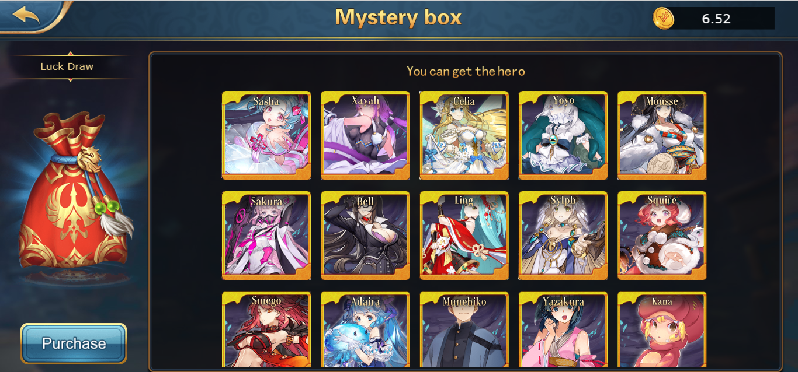

# Game Features

### $XWG Transfer In Game

Transfers are divided into three sections: **Recharge, Withdraw and Record**.

**Recharge**: Recharge $XWG from the wallet to the game platform.

**Withdrawal**: Withdraw $XWG from the game platform to the wallet.

**Record**: View the transaction record of recharge and withdrawal.

.png>)

### NFT Swap

NFT Swap is divided into 3 sections: **Roll in, Roll out and Record**.

**Roll in**: Transfer the cards from the wallet to the game.

**Roll out**: Transfer the cards from the game to the wallet.

**Record**: View the transaction record of roll-in and roll-out.

.png>)

### Mall

All the props in the game can be purchased in the mall.

.png>)

### Mission

The missions are divided into four sections: **Daily Check, Daily Task, Level Reward and Receive Rewards**. Players earn reward points by completing missions with daily check, daily task, and level reward; reward points can be converted into $XWG at a specific time each day according to the player's contribution ratio of reward points, and they can be collected on the receive rewards page.

.png>)

### Backpack

The backpack displays all the props owned by the player which can be deleted or applied.

.png>)

### Marketplace

Click the button to open the external official [Marketplace](https://nft.xwg.games/#/), and players can buy or sell cards with on-chain operations.

.png>)

### Bond

Display all the bond data in the game, including **bond icons, bond composition, and bond effects**.

.png>)

### Leaderboard

The ranking list is divided into **wealth list, combat power list (under development), and winning list**. The rankings are based on $XWG, playing deck strength and total winning percentage, and the top 100 data are displayed. After the development of the subsequent prize pool is completed, corresponding $XWG rewards will be given according to the ranking.

.png>)

### Records

The battle record will display all the battle records of the current player, which is convenient for querying the battle information

.png>)

### Set

Players can view account information, change avatars, set sound effects, log out, and other operations in the set interface

.png>)

### Mystery box

The mystery box is one of the ways players can acquire new cards. Upon clicking "Purchase", players will be directed to this URL [https://xwg.farm/#/pages/index/mystery](https://xwg.farm/#/pages/index/mystery) on the website where they buy purchase mystery boxes.

### Card

The card interface displays all the cards currently owned by the player. Click on a card to display the card's basic attributes, skill attributes, and bond attributes, and you can also upgrade the card level and the star level of the card.

.png>)

### Deck Configuration

The deck interface displays all the information of the battle card deck and can be configured.

.png>)

### Battle

Click the battle button to enter the battle matching queue, and match according to the battle strength of the playing deck.

.png>)

### Expedition

Players can stake cards on the chain through the conquest function, which is divided into ordinary conquest and genesis conquest according to the players’ card type, and obtain corresponding XWG staking rewards according to the card reference price and staking time.

### ELO (Ladder)&#x20;

The ELO mode (ladder) is carried out by seasons, offline battles and ranking. Players participate in the ladder competition by paying a certain amount of registration fee, and $XWG rewards will be given according to the player's ladder rankings after the end of the season.

### Prize pool&#x20;


Under DeveDevelopment&#x20;


A large prize pool to reward some achievement ranked sections for the purpose of promoting the activeness of the game. The source of the prize pool is divided into two parts: the original mining pool mining and the player's defeat in battle.

### PVE&#x20;


Under DeveDevelopment&#x20;


24/7, players can level up through PVE and complete numbers of levels to earn $XWG rewards for the purpose of promoting the activeness of the game. The source of reward is paid from the activity mining pool

### World Boss&#x20;


Under Development


Opening limited time only every day, players will attack the world BOSS through PVE. After killing the world BOSS, the player will be rewarded with $XWG according to the proportion of the kill contribution for the purpose of promoting the activeness of the game. The source of reward is paid from the activity mining pool

