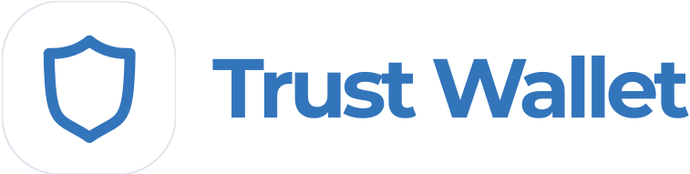

# Wallet Setup

### Blockchain Wallets:

[**MetaMask**](https://metamask.io)****.png>)****

****[**Binance Chain Wallet**](https://www.binance.com/en/wallet-direct) **** .png>)****

****[**Trust Wallet**](https://trustwallet.com) **** ****

[**WalletConnect** ](https://walletconnect.com)****.png>)****

****[**Token Pocket** ](https://www.tokenpocket.pro)****.png>)****

****[**Onto Wallet** ](https://onto.app)****.png>)****

[**Clover Finance** ](https://clover.finance)****.png>)****

[**Coin98 Wallet**](https://wallet.coin98.com) **** .png>)****

[**Math Wallet** ](https://mathwallet.org/en-us/)****.png>)****

****[**imToken** ](https://token.im/download)********

****[**SafePal**](https://safepal.io) **** .png>)****

****[**X Wallet**](https://docs.xwg.games/tools/x-wallet) **** ****

