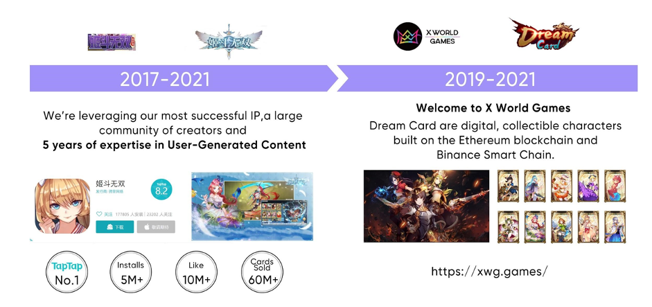

# 歷史

2017年，X World Games還未進入區塊鏈領域前，開發過一款超高人氣動作手游《姬鬥無雙》。該遊戲擁有的30萬的用戶基礎。除此之外，X World Games團隊還開發過近百款線上小遊戲，在傳統遊戲行業有著豐富的遊戲製作經驗。

Fernando作為X World Games的創始人，擁有十多年的投資經驗，對市場的動向有敏銳的嗅覺。前期投過不少區塊鏈、遊戲項目，由此契機，Fernando便逐漸萌生了將游戲、區塊鏈技術、DeFi、NFT等結合到一起，打造一個區塊鏈遊戲生態圈以及元宇宙(metaverse)的想法。

2019年，X World Games開啟了區塊鏈遊戲的征程，延續了這種日系二次元風格，並推出了它第一款可收藏且可戰鬥的NFT卡牌遊戲——Dream Card（夢幻卡牌），也是全球首個日系二次元的 NFT 卡牌對戰遊戲。並已經完成卡牌創世預售。
