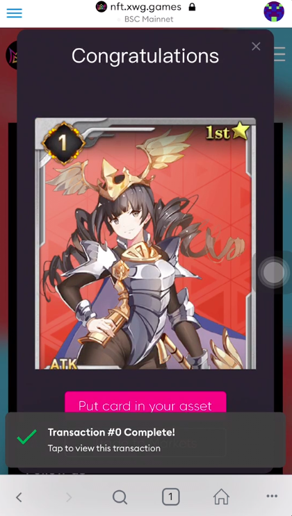
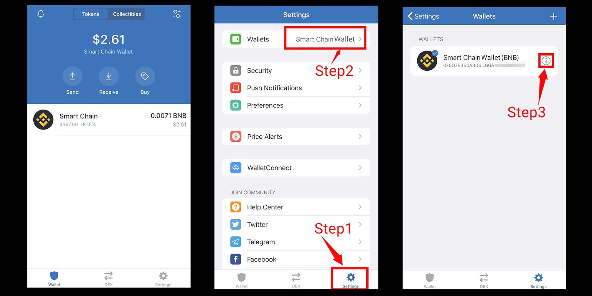

# Airdrop Help

## How to Claim Your NFT Airdrop?

### via Metamask

**Step1:** Log in with your Metamask wallet

**Step 2:** Open your Metamask browser and visit the [airdrop page](https://nft.xwg.games/pages/index/nftairdrop)

**Step 3:** Connect with your selected wallet address

**Step 4:** Click the **Claim Airdrop** button

**Step 5:** Confirm the transaction and pay your gas fee \(BNB\)

**Step 6:** Wait for the transaction completed and the congratulation window will pop up


 You can check your NFTs  from Trust Wallet, Math Wallet or My Asset page of [xwg.games](https://xwg.games)


### Via Trust Wallet \(export to Metamask\)

**Step 1:** Open your Trust Wallet and click **Settings** 

**Step 2**: Select **Smart Chain Wallet** under Wallets

**Step 3**: Click the **Exclamation Icon**

**Step 4**: Select **Export Private Key** to generate the QR code 

**Step 5**: Click the QR code to copy your private key

**Step 6**: Open your Metamask Wallet 

**Step 7**: Click **Navigation Bar**

**Step 8**: Select **Account** on the top-left corner

**Step** **9**: Click **Import on Account** button

**Step 10**: Paste your Private Key

**Step 11**: Click **Import** button to complete


For the rest of procedures, please refer to the **Via Metamask** section on the top.


## Where to Buy BNB?

In order to claim an NFT airdrop, you need to prepare certain BNBs on your wallet account for the gas charge. Please purchase your BNBs from [Binance](https://www.binance.com/), [PancakeSwap](https://pancakeswap.finance/) or any available exchange, and transfer them to your wallet account before claiming an NFT airdrop.

