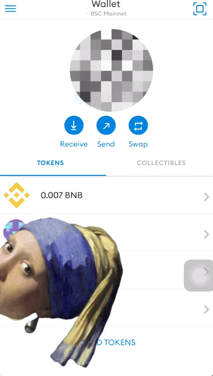
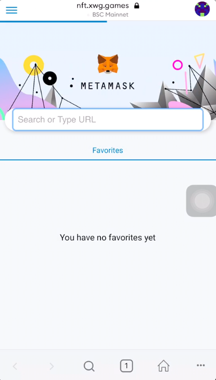
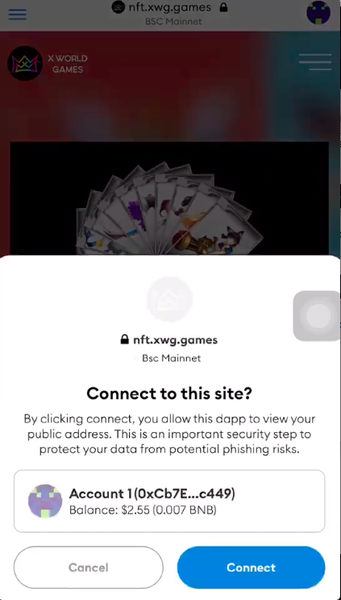
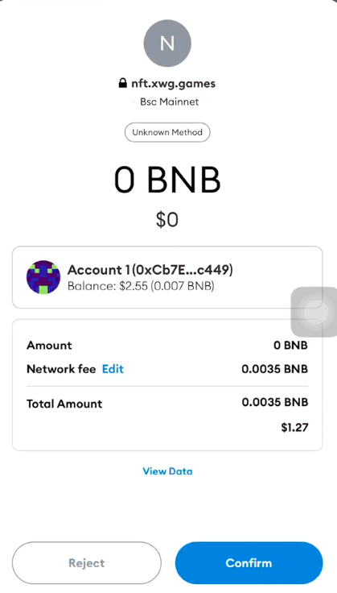
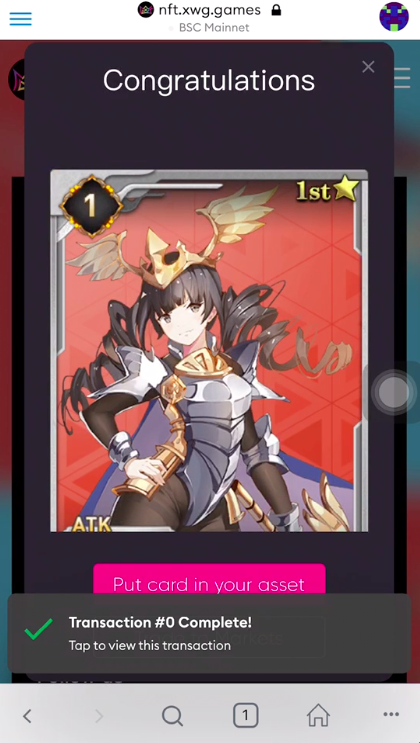
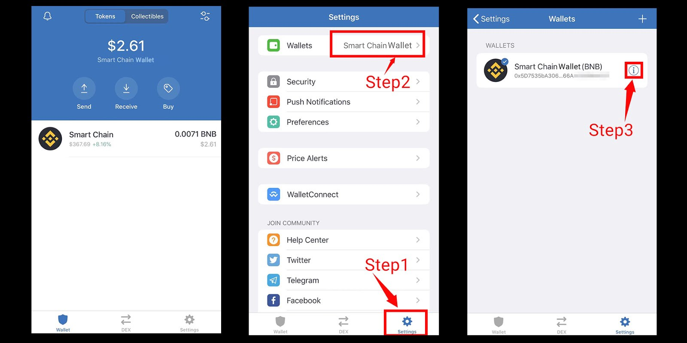
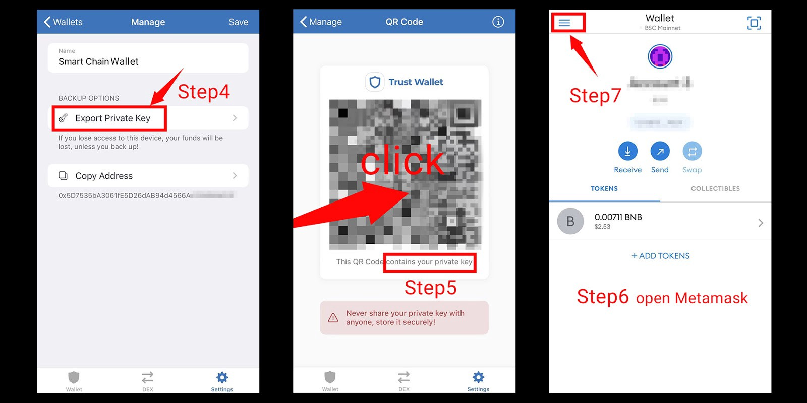
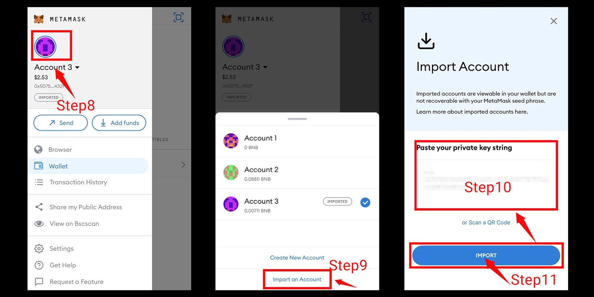

# 空投教学

## 如何领取您的NFT空投？

### 使用Metamask

**Step 1:** 登入您的Metamask钱包

**Step 2:** 打开您的Metamask浏览器并访阅[空投页面](https://nft.xwg.games/pages/index/nftairdrop)

**Step 3:** 点击连接您所选择的钱包地址帐户

**Step 4:** 点击**Claim Airdrop** 按键

**Step 5:** 确认交易并支付手续费用 \(BNB\)

**Step 6:** 等待交易完成和**congratulations**视窗出现


您可以从 Trust Wallet、Math Wallet 或 XWG官网的[My Asset页面](https://nft.xwg.games/pages/props/mnft)查看您的NFTs。 


### 使用Trust Wallet \(导出至 Metamask\)

**Step 1:** 打开你的Trust Wallet并点击**Settings** 

**Step 2**: 选择Wallets中的**Smart Chain Wallet**

**Step 3**: 点击**惊叹图示**

**Step 4**: 选择**Export Private Key**产生二维码 

**Step 5**: 点击二维码以复制您的私钥

**Step 6**: 打开您的Metamask钱包

**Step 7**: 点击左上角菜单栏

**Step 8**: 选择左上角的**Account**

**Step** **9**: 点击**Import on Account**按键

**Step 10**: 贴上您的私钥

**Step 11**: 点击**Import**完成私钥导入


对于剩余步骤，请参阅顶部的 **使用Metamask** 部分。


## 如何购买 BNB?

为了在币安智能链上领取NFT 空投，您需要在您的钱包账户中准备某些 BNB 以支付手续费用。请从 [币安](https://www.binance.com/zh-CN)、[PancakeSwap](https://pancakeswap.finance/) 或任何可用的交易所购买您的 BNB，并将它们转移到您的钱包账户，然后再领取 NFT 空投。

