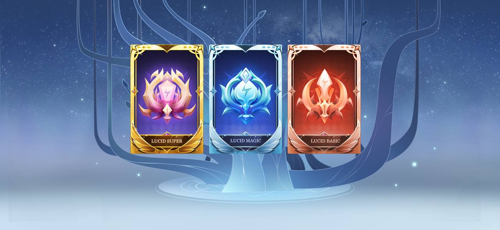

# 🃏 LUCID

X World Games is excited to unveil the newest BEP-1155 token asset — _**LUCID.**_

LUCID will be the primary play-to-earn reward asset throughout the XWG ecosystem. As X World Games enters the next phase of external gaming integration, the single-token economy model won’t be fit and inclusive enough to embrace the whole gaming metaverse. Therefore, LUCID will be the new incentive of Play-to-Earn and pave the path to XWG’s latest introduction of the Play-to-Earn-to-Stake (P2E2S) economy.

### **What is BEP-1155?** 

BEP-1155 is the multi-token standard that combines the fungibility of BEP-20 and the non-fungibility of BEP-721 in one contract, which finds a middle ground of fungibility-agnostic and gas-efficient (yes, cheaper gas!).

With a single BEP-1155 contract, users can deploy a token economy with fungible (tokens) and non-fungible (NFTs). Crypto projects like Axie Infinity have adopted similar models incorporating BEP1155 and multi-asset / token smart contracts into their gaming tokenomics.

BEP1155 in the X World Games will be an NFT-like asset that can be traded across all NFT marketplaces, like Opensea, Looksrare, and XWG’s official X Marketplace.

### **What is LUCID? How can I earn it?** 

Players can earn LUCID from playing games on the X World Games multi-gaming platform. Rewards can be generated from loot boxes to single-match wins. LUCID will have three types of rarity: Basic, Magic, and Super. The higher rarity ones will have a smaller drop probability and only can be obtained via holding higher-level characters or completing higher-level chapters.

### **LUCID and X Pool** 

LUCID will be the crucial and required fuel for staking with the X Pool. Players must consume a certain amount of LUCID while staking their Dream Cards to earn $XWG tokens. The staking mechanism with LUCID is now attached to the length of time staked, which means the more LUCID a player consumes while staking, the longer period that player can stake.

### **LUCID and Dream Card** 

Similarly, LUCID will be consumed for our new DreamCard upgrade mechanisms: Evolution & Fusion.

Players can craft higher rarity with the required amount of $XWG tokens, LUCIDs, and DreamCards they would like to upgrade through Evolution. To craft higher rarity DreamCards (i.e., Legendary or Mythic) will need higher rarity of LUCIDs — the Magic & Super.

The asset Shard will be the primary consuming token for the Fusion mechanism, which we’ll discuss in the coming introduction.

### **Why are we switching to LUCID?** 

LUCID will gain dominance and become XWG’s primary play-to-earn reward asset, while the $XWG token will lean its attribute more towards being the XWG governance token (DAO token). Hence, XWG will have a more adequate and sustainable economic design to ease the token inflationary pressure and bring more possibilities for making financial adjustments. A key point to address is whenever LUCID is consumed, it will be burned and thus removed from the supply.

With the new changes and the addition of LUCID, the X World Games ecosystem is becoming more complex but dynamic. These changes will promote healthy and vibrant economic growth in our earning scheme, tokenomics, and player userbase.

\
