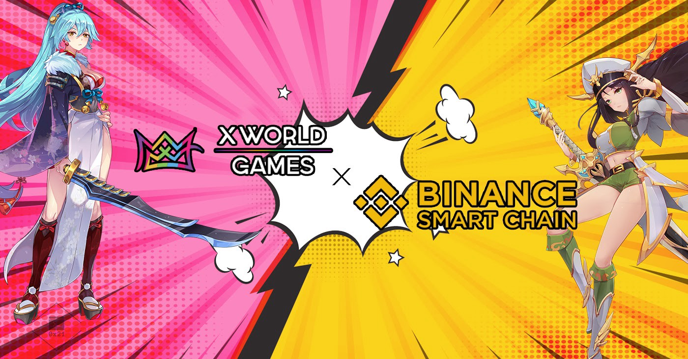

# Token Network

X World Games has adopted different protocols for the issuance of various digital assets. The XWG token issuance adopts BEP-20 from Binance Smart Chain, given its security, scalability and affordability, we believe this will maximize our player base and lower the shifting cost for our players coming from the conventional gaming world. \

On the NFT side, they will be based on the BEP-1155 and BEP-721. As part of our infrastructure construction, we're building a layer-2 protocol to scale the NFT trading, which can be integrated with many different development protocols or side-chains to limit the amount of storage and hash power required to validate blocks during a transaction. We aim to facilitate more than 20,000 transactions per second (TPS) with instant minting ability, and most importantly, no gas fee. So gamers can finally play, create and trade without worries and experience the true decentralizing gaming.\
