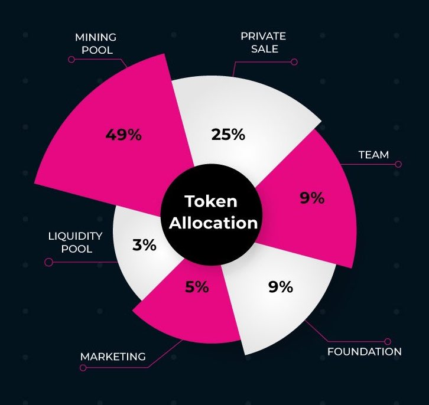

# $XWG Allocation

## \*\*\*\*

#### Mining Pool: 49%, 4,900,000,000 XWG

This portion will be reserved an incentive for daily game mining. X World Games has designed an inflationary token release mechanism for in-game mining, in which the amount of release will be doubled every year and complete release in 10 years.   

#### Liquidity Pool: 3%, 300,000,000 XWG

This portion will serve as an incentive for the ecosystem market maker to provide liquidity for XWG on the DeFi platforms.  

#### Marketing: 5%, 500,000,000 XWG

This portion will be reserved for future ecosystem development, including game incubation, social media marketing, and community events. The tokens will be fully locked at the project initiation phase, and a specific portion of tokens can be released on an as-needed basis by the future announcement.    

#### Seed Sale: 8%, 800,000,000 XWG

This portion will be held by the project early financers, including seed/strategic sale rounds. No public offering was made. There are different lock-up timeframes for different financing rounds. For the seed sale, starting from the initiation of circulation, the lock-up period is 6 months and gradually released within 12 months.   

#### Strategic Sale: 17%, 1,700,000,000 XWG

This portion will be held by the project early financers, including seed/strategic sale rounds. No public offering was made. There are different lock-up timeframes for different financing rounds. For the strategic sale, starting from the initiation of circulation, there is no lock-up period and will be gradually released within 12 months.   

#### Team: 9%, 900,000,000 XWG

The portion will be allocated as incentives for project founders, employees, and advisors. There will be a graded vesting period for 36 months with a six-month lock-up period, starting from the initiation of circulation. An additional 18-months cliff vesting period will be applied, which means that only members who have stayed with the project for more than 18 months can receive this incentive.  

#### Foundation: 9%, 900,000,000 XWG

This portion will be reserved for Foundation’s operations, including auditing, consulting, branding, researching, legal and overhead costs. Tokens will be fully locked at the project initiation phase,  and only a certain portion can be released on an as-needed basis by the future announcement.    

In addition, X World Games will initiate repurchasing/burning and other re-offering systems through decentralized governance to achieve a better economic deflation and ecological incentive mechanism. The detailed operation will begin with the community proposal and voting, and the whole process will be open and transparent.

