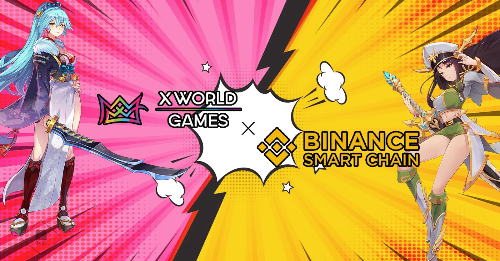

# 通證標準

X World Games 在不同的數位資產發行上採用了不同的協議制度。在XWG通證發行上是採用幣安智能鏈 (Binance Smart Chain) 的BEP-20，鑑於其安全性，可擴展性和可承受性，我們相信這將最大程度地擴大我們的玩家用戶群，並降低來自傳統遊戲世界的玩家的轉移成本。

而在NFT發行上則採用BEP-1155和BEP-721。作為基礎架構建設的一部分，我們正在為其構建第2層協議以擴展NFT交易，該協議可與許多不同的開發協議或側鏈集成，以限制在交易期間驗證區塊所需的存儲量和算力。我們的目標是通過即時鑄造功能（最重要的是不收取GAS）促進每秒超過20,000個交易（TPS）。\
