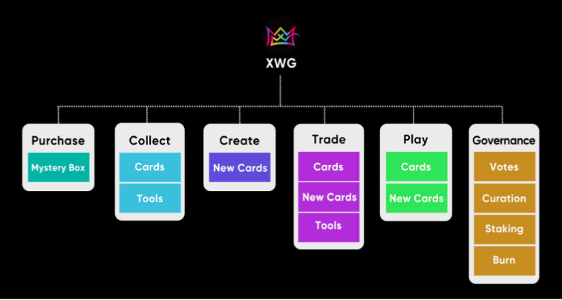

# 通證用途

## $XWG

**$XWG** 代幣是 X World Games 的原生通證，基於幣安智能鏈的 BEP-20 標準構建，固定總供應量為 100 億。

$XWG 是推動 X World Games 生態系統發展的重要燃料。

&#x20;$XWG 持有者將能夠通過參與遊戲挖礦機制、DeFi 運營和 DAO 投票過程來領取獎勵。 $XWG 也將被接受作為 X World Games Marketplace 的支付貨幣，玩家可以在這裡買賣他們的遊戲內 NFT 資產。

## 通證用途

| 用途          | 叙述                                                                                                                                                     |
| ----------- | ------------------------------------------------------------------------------------------------------------------------------------------------------ |
| 購買支付        | $XWG 是玩家用來購買遊戲內物品和參與遊戲活動的數字通證。                                                                                                                         |
| 礦池獎勵        | 礦池獎勵是一種通過從玩遊戲中獲得通證獎勵來豐富遊戲生態系統的方法。通證持有者可以參與創建新卡並作為創建者從市場中賺取代幣。例如，X World Games 平台會從卡牌銷售、NFT資產銷售、交易費用等方面獲得收入，並按照固定比例分配給質押池獎勵。還將具有 DeFi礦池功能，例如抵押、回購和銷毀機制。 |
| 去中心化治理      | 擁有 XWG 通證使玩家能夠通過去中心化自治組織 (DAO) 參與治理過程，並具有開發提案和投票結構。與平台運營和開發相關的問題可以根據代幣持有者的偏好進行投票。為了鼓勵用戶參與投票過程，投票行為也會有獎勵。                                               |
| 遊戲挖礦        | 
有一部分通證預留給用戶遊戲挖礦獎勵。玩家可以通過簡單地玩遊戲來賺取 XWG 通證。這種設計是為了鼓勵用戶參與遊戲，發展社區並保持平台牽引力。 
                                                                      |
