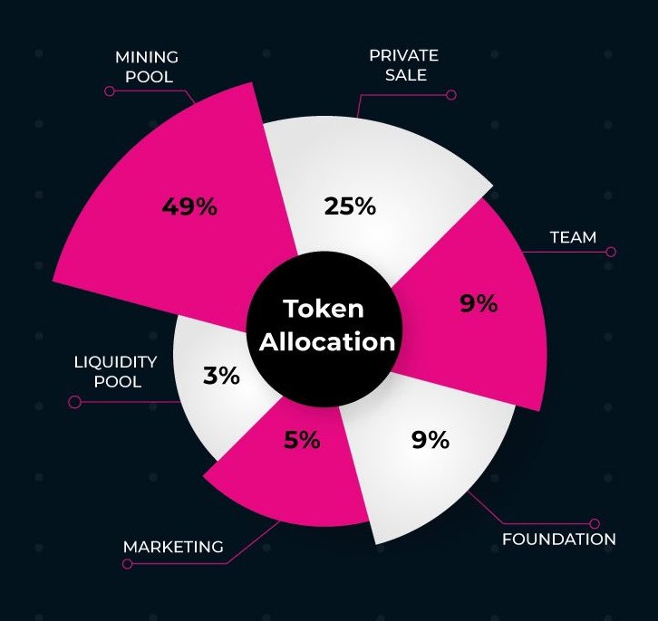

# $XWG 分配计划

## \*\*\*\*

#### 激励矿池: 49%, 4,900,000,000 XWG

此部分将预留为日常游戏挖矿所产出的激励。X World Games在游戏挖矿中设计了通胀的代币释放机制，分10年释放，每年递增1倍。  

#### 流动矿池: 3%, 300,000,000 XWG

此部分将作为项目生态做市商在DeFi平台为XWG凭证提供流动性之激励。  

#### 营销: 5%, 500,000,000 XWG

此部份基金将作为社区发展预留使用，包括帮助项目孵化，社群营销，线下聚会以及社区贡献激励。社区预留基金在项目初始阶段将会被完全锁定，日后可依需要提出声明而解锁部分资金。  

#### 种子融资: 8%, 800,000,000 XWG

此部份为项目早期对种子/战略投资机构之融资私募分配，非公开贩售。针对不同融资轮有着不同锁定期限，种子融资轮由流通启动算起，锁定6个月，然后分12个月逐步释放。  

#### 战略融资: 17%, 1,700,000,000 XWG

此部份为项目早期对种子/战略投资机构之融资私募分配，非公开贩售。针对不同融资轮有着不同锁定期限，战略融资轮由流通启动算起，无锁定，分12个月逐步释放。  

#### 团队: 9%, 900,000,000 XWG

此部份将作为项目创始者，团队，员工，顾问等激励用途。锁定期\(Lock-up Period\)为12个月，之后按36月分梯解绑\(Graded Vesting\)，皆由流通启动算起。另外还有18个月最短生效期\(Cliff Period\)，意指只有在项目待满18个月以上之团队成员可获得此部份激励。  

#### 基金会: 9%, 900,000,000 XWG

此部份将作为未来X World Games基金会营运及发展使用，包括审计，咨询，研究，法律及营运费用。在项目初始阶段将会被完全锁定，日后可依需要提出声明而解锁部分资金。  

另外，X World Games将可通过去中心化治理启动回购/销毁以及增发等制度，以便执行更好的经济通缩以及生态激励机制。详细操作将经由社群提案开始，投票决定，详细过程将公开透明。  

