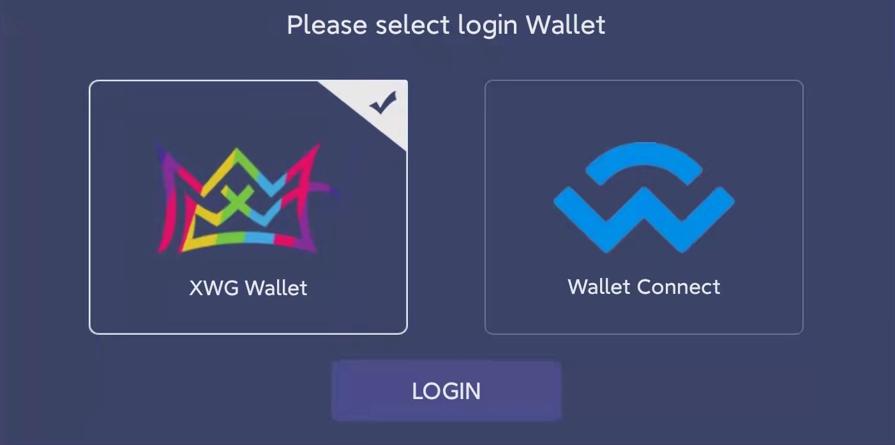
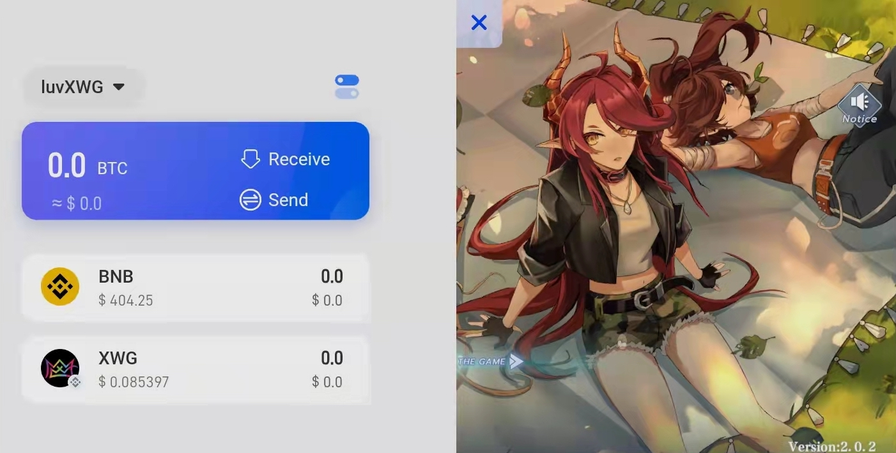

# X Wallet

### An accessible crypto wallet for your blockchain games

#### _**X Wallet will be integrated with Dream Card v2 to ease the game access. It’s a BSC-friendly wallet built for X World Games. The X Wallet will support Dream Card v1 and Dream Card v2.**_

_****_

Building the gaming ecosystem is always the top priority carved on X World Games' mission statements, and the comfort of access is the first step in constructing its infrastructure. Players will always select the least bumpy route with the smoothest experience.

On the other hand, many gaming dApps out there fail to pave such a path because they rely on 3rd-party wallets to onboard users. When the login becomes problematic and complicated, players usually prefer to give up and exit through the red button on the top right-hand corner.

The X World Games platform includes a variety of wallet accesses that ensure a freedom-of-choice experience across all functionalities. However, with the X Wallet delivered by X World Games, designed explicitly for gaming dApps on Binance Smart Chain, players are guaranteed to have the best user experience and the most accessible process integrated with the XWG ecosystem.

X Wallet is fast, safe, and user-friendly, while many new innovative functions such as NFTs and Collectibles showcase, easy-staking, and Web3 support are in planning to release. Players will have their keys stored in Cloud with a non-custodial approach; this keeps your private keys and funds safe, secured, and decentralized.

X World Games has developed an embedded version of X Wallet and integrated it with Dream Card v1 & v2 to ensure that users remain in control of all their crypto assets, which also assures that your tokens and NFTs can be accessible from anywhere, at any time.

In the future, users may cast several more additional functions, like browsing and logging trending dApps, storing and transferring NFT collectibles, and comparing and joining staking pools, all in one ultimate destination - X wallet.

