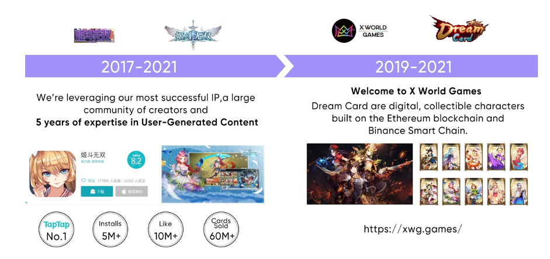

# History

In 2017, before X World Games entered the blockchain, it had developed a super popular Japanese action mobile game, "Belle Battle Musou.", which has a user base of 300,000. In addition, the X World Games team had developed nearly a hundred online mini-games and has rich experience in game production in the mobile game industry.

As the founder of X World Games, Fernando has more than a decade of investment experience and a keen sense of market trends. In his early years, he had invested in many blockchain and mobile game projects. Therefore, he slowly has an idea to merge all these interesting elements, games, blockchain, DeFi, Japanese anime, NFT, metaverse, etc., all together to create a blockchain game ecosystem and metaverse.

In 2019, X World Games started the journey of blockchain games, advanced with the Japanese ACG style, launched its first NFT TCG game project - Dream Card, and completed its Genesis Sale in 2021.

X World Games will be completing a gigantic platform infrastructure plan for the product, including a gaming hub, NFT exchange, cross-game protocol port, and a full-function game-creation toolbox. Meanwhile, X World Games will be enriching the gaming ecosystem and community by publishing more games and signing more authentic anime IPs, and connecting migrated games with pre-established tokenomic systems, and guiding the player community to a full DAO governance.
