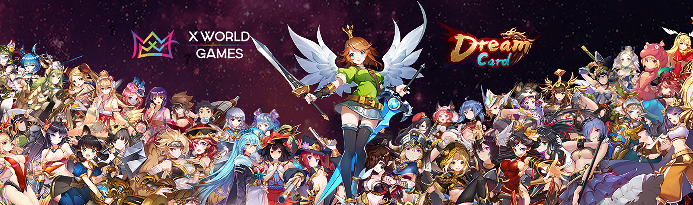

# Vision

The vision of X World Games is to build a diversified gaming ecosystem that connects traditional game players and the blockchain world, also help more game developers who would like to enter the crypto space by creating and providing an underlying blockchain framework.

X World Games will be a gaming platform that connects blockchain with thousands of players from the conventional gaming world. X World Games is currently working with many game developers to attract more conventional gamers and expand its ecosystem, aiming to become the "Open Sea" in the field of blockchain games and a steam-like blockchain gaming hub.

